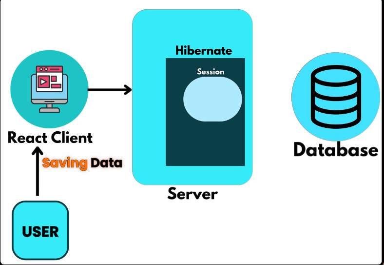
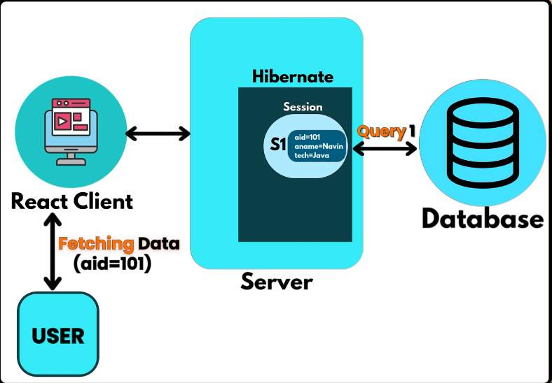
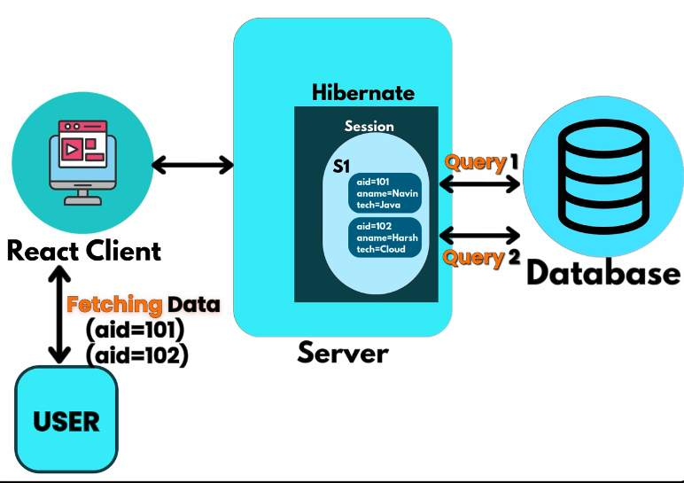
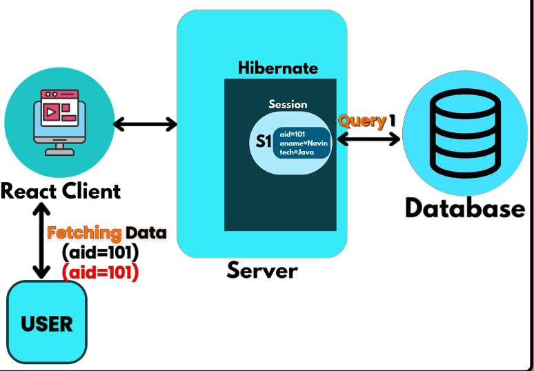
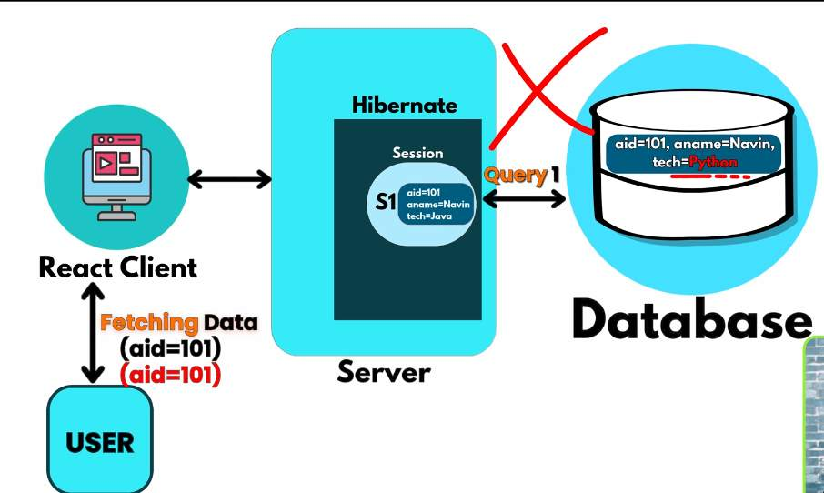
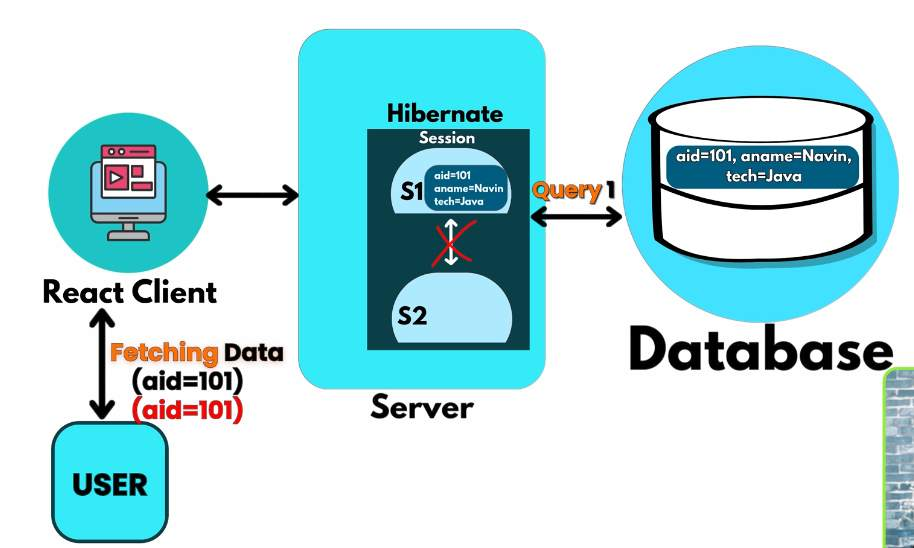
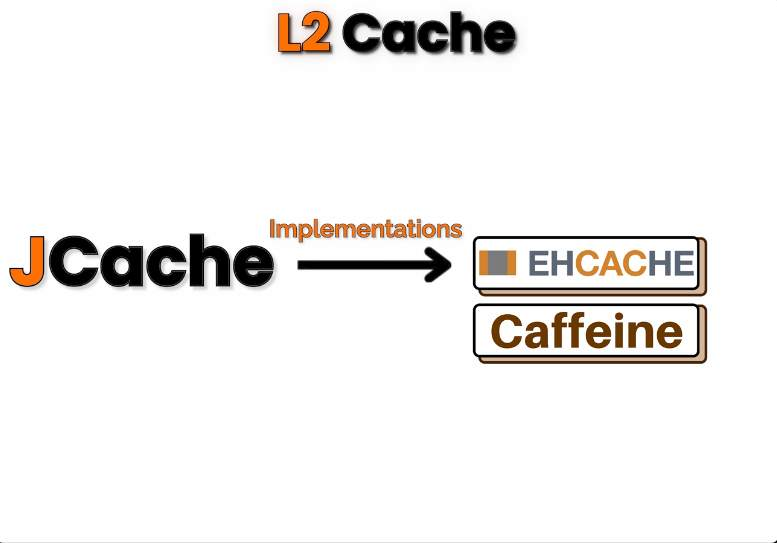
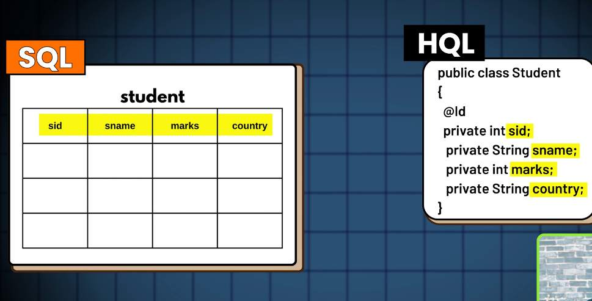

## Hibernate Caching







- This is L1 cache


- In between fetching if data got changed
	- we have take care when to use cache and when not to



- By default hybernate provides `L1 Cache`

- If there were two sessions
	- and if one contains the fetched data and other does not
	- can these two sessions interact, `NO` by `default` hybernate will not allow it


- In case we need above behaviour, we need to use some external application that provides `L2 cache`
- Hybernate uses `Jcache` to achieve this
	- there are multiple implementations for it


### HQL (Hibernate Query Language)

- Derived from SQL itself
- We can use methods like
	- session.find(Classname.class, primarykey)
	- session.remove(object)
	- session.merge(object)
- If we want to filter in a Student column say with `name`
	- or `marks > threshold` ...
	- for these we have to write queries
	> [!NOTE]
	> we can also write sql queries which are called (native queries)
	- if we do not wish to write queries
		- we can use `HQL`

- for example
	- if we want to fetch everything from table student
	- in SQL, 
		- we do `select * from student`
	- in HQL
		- we do `from Student`
			- here `Student` is not a table it is entity

- To execute above statement we have to use something called a `Query` -> `org.hibernate.query.Query;`
	- `Query` is an interface
		- we cannot create an object of it
		- but we can create a reference of it using `Session` object
			- `Query query = session.createQuery("from Laptop", Laptop.class)`
	- Now to get the result/records we do
		- `List<Laptops> laptops = query.getResultSet();`

```java
@SpringBootApplication
public class DemoApplication {
	public static void main(String[] args) {
		SpringApplication.run(DemoApplication.class, args);

		Laptop l1 = new Laptop();
		l1.setLid(4);
		l1.setBrand("Asus");
		l1.setModel("Strix");
		l1.setRam(32);

		Configuration cfg = new Configuration();
		// cfg.addAnnotatedClass(com.example.hibernate_test.Student.class);
		// cfg.configure();

		SessionFactory sf = cfg
				.addAnnotatedClass(com.example.hibernate_test.Laptop.class)
				.configure()
				.buildSessionFactory(); // cfg.buildSessionFactory();
		Session session = sf.openSession();

		// select * from Laptop; -> SQL
		// from * laptop -> HQL
		// Query query = session.createQuery("from Laptop", Laptop.class);
		// select * form laptop where ram = 32; -> SQL
		// from laptop where ram = 32; -> HQL
		Query query = session.createQuery("from Laptop where ram=32", Laptop.class);
		List<Laptop> laptop = query.getResultList();

		System.out.println(laptop);

		session.close();
		sf.close();
	}
}
```

### Fetching with filter and Specific properties

- `Query query = session.createQuery("from Laptop where brand like 'Asus'", Laptop.class);`

```java
String brand = "Asus";

Query query = session.createQuery("from Laptop where brand like ?1", Laptop.class);
query.setParameter(1, brand);
List<Laptop> laptop = query.getResultList();
```
- We have to specify `?1` in the query then while setting the parameter we can use
- `query.setParameter(1, brand);`

- Fetch specific columns only 
```java
String brand = "Asus";

Query query = session.createQuery("select model from Laptop where brand like ?1");
query.setParameter(1, brand);
List<String> laptops = query.getResultList();
```

- here if we mention 
	- `Query query = session.createQuery("select model from Laptop where brand like ?1", Laptop.class);`
	- the we get this error

```log
2026-02-13T07:05:04.513+05:30  INFO 26199 --- [demo] [           main] org.hibernate.orm.connections.access     : HHH10001501: Connection obtained from JdbcConnectionAccess [org.hibernate.engine.jdbc.env.internal.JdbcEnvironmentInitiator$ConnectionProviderJdbcConnectionAccess@2d41bb5a] for (non-JTA) DDL execution was not in auto-commit mode; the Connection 'local transaction' will be committed and the Connection will be set into auto-commit mode.
Exception in thread "main" org.hibernate.query.QueryTypeMismatchException: Incorrect query result type: query produces 'java.lang.String' but type 'com.example.hibernate_test.Laptop' was given
	at org.hibernate.query.sqm.internal.SqmUtil.throwQueryTypeMismatchException(SqmUtil.java:1321)
	at org.hibernate.query.sqm.internal.SqmUtil.verifyResultType(SqmUtil.java:1252)
	at org.hibernate.query.sqm.internal.SqmUtil.verifySelectionType(SqmUtil.java:1221)
	at org.hibernate.query.sqm.internal.SqmUtil.verifySingularSelectionType(SqmUtil.java:1178)
	at org.hibernate.query.sqm.internal.SqmUtil.checkQueryReturnType(SqmUtil.java:1151)
	at org.hibernate.query.sqm.internal.SqmUtil.checkQueryReturnType(SqmUtil.java:1110)
	at org.hibernate.query.spi.SimpleHqlInterpretationImpl.validateResultType(SimpleHqlInterpretationImpl.java:55)
	at org.hibernate.query.sqm.internal.QuerySqmImpl.<init>(QuerySqmImpl.java:183)
	at org.hibernate.internal.AbstractSharedSessionContract.createQuery(AbstractSharedSessionContract.java:892)
	at org.hibernate.internal.AbstractSharedSessionContract.createQuery(AbstractSharedSessionContract.java:137)
	at com.example.hibernate_test.DemoApplication.main(DemoApplication.java:35)
```

- If there are multiple like `brand`, `model`
	- it will return `Object[]`
	- we have to typecast it to `String`
```java
String brand = "Asus";

Query query = session.createQuery("select model, brand from Laptop where brand like ?1");
query.setParameter(1, brand);
List<Object[]> laptops = query.getResultList();

for (Object[] data : laptops) {
	System.out.println((String) data[0] + " " + (String) data[1]);
}
```

### get() vs Load()

- Eager fetching vs Lazy fetching

> [!NOTE]
> it is marked as deprecated since version 7.0
- we use `find(Laptop.class, 1)` method
- `EAGER` loading
- fires the select query even when we do not try to print the value


```java
@SpringBootApplication
public class DemoApplication {
	public static void main(String[] args) {
		SpringApplication.run(DemoApplication.class, args);

		Configuration cfg = new Configuration();
		// cfg.addAnnotatedClass(com.example.hibernate_test.Student.class);
		// cfg.configure();

		SessionFactory sf = cfg
		.addAnnotatedClass(com.example.hibernate_test.Laptop.class)
		.configure()
		.buildSessionFactory(); // cfg.buildSessionFactory();
		Session session = sf.openSession();

		Laptop l = session.get(Laptop.class, 2);
		System.out.println(l);

		session.close();
		sf.close();
	}
}
```

- `load()` -> `.byId().getReference()` or `.getReference(Laptop.class, 1)` -> LazyLoading
> [!NOTE]
> load() is removed we need to use `session.byId(Laptop.class).getReference(primarykey)`
- does not fire the `select` query immediately
	- meaning it will not hit the database immediately
```java
@SpringBootApplication
public class DemoApplication {
	public static void main(String[] args) {
		SpringApplication.run(DemoApplication.class, args);

		Configuration cfg = new Configuration();
		// cfg.addAnnotatedClass(com.example.hibernate_test.Student.class);
		// cfg.configure();

		SessionFactory sf = cfg
		.addAnnotatedClass(com.example.hibernate_test.Laptop.class)
		.configure()
		.buildSessionFactory(); // cfg.buildSessionFactory();
		Session session = sf.openSession();

		Laptop laptop = session.byId(Laptop.class).getReference(1);


		session.close();
		sf.close();
	}
}
```

- If I do a print statement after `session.getReference()` then only it fires a select query
```logs
2026-02-13T07:32:20.486+05:30  INFO 33704 --- [demo] [           main] org.hibernate.orm.connections.access     : HHH10001501: Connection obtained from JdbcConnectionAccess [org.hibernate.engine.jdbc.env.internal.JdbcEnvironmentInitiator$ConnectionProviderJdbcConnectionAccess@2d41bb5a] for (non-JTA) DDL execution was not in auto-commit mode; the Connection 'local transaction' will be committed and the Connection will be set into auto-commit mode.
Hibernate: select l1_0.lid,l1_0.brand,l1_0.model,l1_0.ram from Laptop l1_0 where l1_0.lid=?
Laptop [lid=2, brand=Apple, model=Macbook Air, ram=32]
```

### Level 2 cache using Ehcache

```java
@SpringBootApplication
public class DemoApplication {
	public static void main(String[] args) {
		SpringApplication.run(DemoApplication.class, args);

		Configuration cfg = new Configuration();
		// cfg.addAnnotatedClass(com.example.hibernate_test.Student.class);
		// cfg.configure();

		SessionFactory sf = cfg
		.addAnnotatedClass(com.example.hibernate_test.Laptop.class)
		.configure()
		.buildSessionFactory(); // cfg.buildSessionFactory();
		Session session = sf.openSession();
		Laptop laptop = session.getReference(Laptop.class, 1);
		System.out.println(laptop);
		session.close();

		Session session1 = sf.openSession();
		Laptop laptop1 = session1.getReference(Laptop.class, 1);
		System.out.println(laptop1);
		session1.close();

		sf.close();
	}
}
```

- When we create two sessions and fire the select query, by default L1 cache can interact between two sessions

```logs
Hibernate: select l1_0.lid,l1_0.brand,l1_0.model,l1_0.ram from Laptop l1_0 where l1_0.lid=?
Laptop [lid=1, brand=Asus, model=Tuf, ram=16]
Hibernate: select l1_0.lid,l1_0.brand,l1_0.model,l1_0.ram from Laptop l1_0 where l1_0.lid=?
Laptop [lid=1, brand=Asus, model=Tuf, ram=16]
```

- Steps to achieve level 2 cache

1. we can use these dependencies
> [!NOTE]
> keep hibernate-jcache dependency version same as hibernate-core dependency version

```xml
<dependency>
	<groupId>org.hibernate.orm</groupId>
	<artifactId>hibernate-jcache</artifactId>
	<version>7.2.4.Final</version>
	<scope>compile</scope>
</dependency>
<dependency>
	<groupId>org.ehcache</groupId>
	<artifactId>ehcache</artifactId>
	<version>3.11.1</version>
	<scope>compile</scope>
</dependency>
```

- If receive 3.8.1 http repository are blocked error
- workaround
	- change maven settings to 3.6
		- not sure will work or not

	- we need to add `jaaxb-runtime` dependency
```xml
<dependencyManagement>
	<dependencies>
		<dependency>
			<groupId>org.glassfish.jaxb</groupId>
			<artifactId>jaxb-runtime</artifactId>
			<version>4.0.6</version>
			<scope>compile</scope>
		</dependency>
	</dependencies>
</dependencyManagement>
```

2. Add this in `hibernate.cfg.xml` 
```xml
<property name="hibernate.cache.use_second_level_cache">true</property>

<property name="hibernate.cache.region.factory_class">
			org.hibernate.cache.jcache.JCacheRegionFactory
</property>

<property name="hibernate.jakarta.cache.provider">
			org.ehcache.jsr107.EhcacheCachingProvider
</property>

<property name="hibernate.jakarta.cache.uri">
	ehcache.xml
</property>
```

3. Add `@Cacheble` on top of Entity class

- After this even when we use two different session for same select query
- the select query fires only once

```log
2026-02-13T08:13:09.231+05:30  INFO 48090 --- [demo] [           main] org.hibernate.orm.connections.access     : HHH10001501: Connection obtained from JdbcConnectionAccess [org.hibernate.engine.jdbc.env.internal.JdbcEnvironmentInitiator$ConnectionProviderJdbcConnectionAccess@5b78a946] for (non-JTA) DDL execution was not in auto-commit mode; the Connection 'local transaction' will be committed and the Connection will be set into auto-commit mode.
Hibernate: select l1_0.lid,l1_0.brand,l1_0.model,l1_0.ram from Laptop l1_0 where l1_0.lid=?
Laptop [lid=1, brand=Asus, model=Tuf, ram=16]
Laptop [lid=1, brand=Asus, model=Tuf, ram=16]
2026-02-13T08:13:09.302+05:30  INFO 48090 --- [demo] [           main] org.ehcache.core.EhcacheManager          : Cache 'com.example.hibernate_test.Laptop' removed from EhcacheManager.
```
