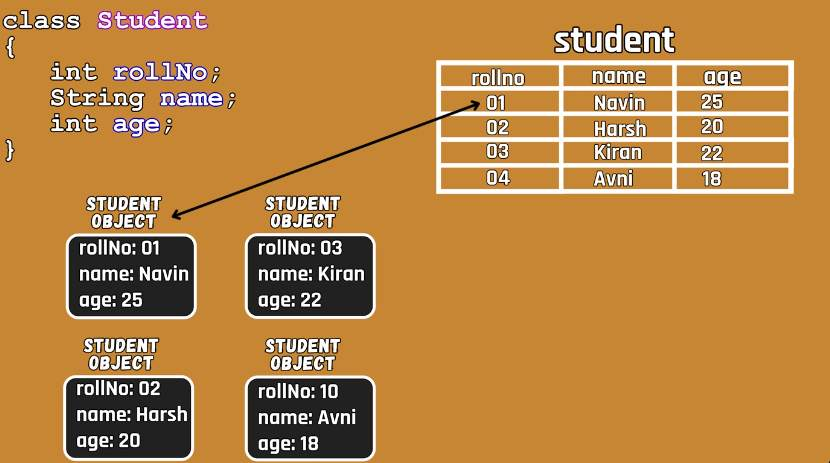
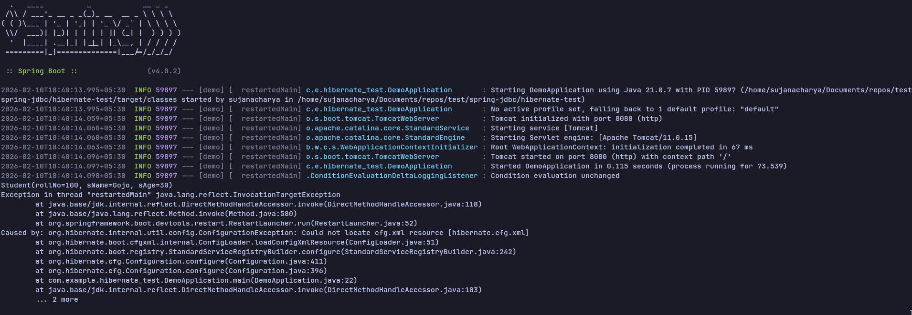
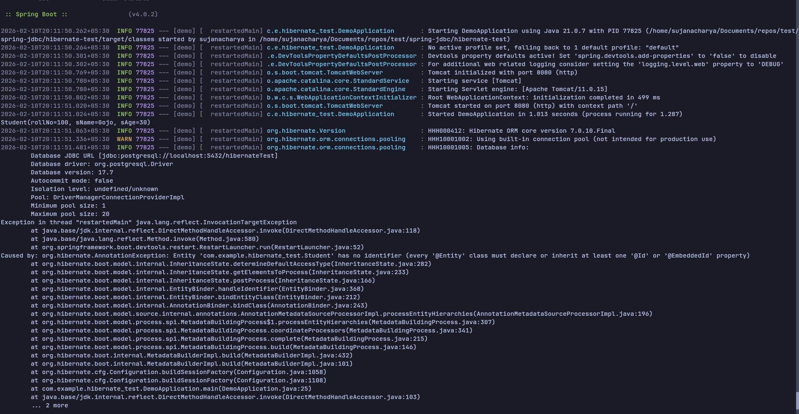

## Hibernate

- ORM(Object Relational Mapping) framework
	- ORM understands the object
		- the class represents -> entity like a table
		- the fields represents the column names


- we can implement this using hibernate

- `Session`
	- is an interface
	- using its reference we can process the object

- we can use `save()` method to save the object to database
> [!NOTE]
> this method has been deprecated 6.6.3, and removed in 7.1.0, we have to use `session.persist(object)`


- To create a `Session` we have to follow some steps
	- Who can create a `Session`
		- it can be created by a `SessionFactory`
		- `SessionFactory`
			- is an interface 
	- we can create a reference of `Session` using `SessionFactory`'s `openSession()` method
		- there are other methods as well like `getCurrentSession()` which gives the reference to current open session
		- to connect to a database and perform some actions is costly 
		- we can however any number of sessions
			- as for any unit of work we will be using a new session 
		- `SessionFactory` is a heavy weight object, it will consume lot of resources
	- To get the reference of `SessionFactory` we need to first get an object of `Configuration`
		- `Configuration`
			- > [!NOTE]
			> org.hibernate.cfg
			- is a class
			- we can create its object by using `new` keyword
			- once we get the `Configuration` object we can call the `SessionFactory`'s `buildSessionFactory()` method
				- which will give the object of `SessionFactory`

- for configuring jdbc so that hibernate can talk to database, we need to configure the database details, by default it will search for `hibernate.cfg.xml`
	- we can use different names
- if we don't we get below error
	- by default 
	- `Could not locate cfg.xml resource [hibernate.cfg.xml]`

```java
<hibernate-configuration xmlns="http://www.hibernate.org/xsd/orm/cfg">
	<session-factory>
		<property name="hibernate.connection.driver_class">org.postgresql.Driver</property>
		<property name="hibernate.connection.url">jdbc:postgresql://localhost:5432/dbname</property>
		<property name="hibernate.connection.username">db_username</property>
		<property name="hibernate.connection.password">passwd</property>

		// <property name="hibernate.hbm2ddl.auto">update</property> // in production we won't use this
		// <property name="hibernate.hbm2ddl.auto">create-drop</property> // will create and drop each time 
		<property name="hibernate.hbm2ddl.auto">create</property> 

		<property name="hibernate.diablect">org.hibernate.dialect.PostgresPlusDialect</property>

		<property name="hibernate.show_sql">true</property>
		<property name="hibernate.format_sql">true</property>
	</session-factory>
</hibernate-configuration>
```
- `cfg.configure()`
	- to configure hibernate related details
- After adding this we still get error
	- `Unable to locate perister: com.example.Student`
		`Caused by: org.hibernate.UnknownEntityTypeException: Unknown entity type: com.example.hibernate_test.Student`
- We need to map/add our class we have to add the configuration 
	- we can do this in two ways
		1. by adding the property in `hibernate.cfg.xml`
		2. using `cfg.addAnnotatedClass(com.example.hibernate_test.Student.class);`
	- Even after adding the above configuration
		- we still get the same error as before
	- So if we want this class to be managed by the hibernate, we have to use the Annotation `@Entity`
		- now we get this error

	- `Caused by: org.hibernate.AnnotationException: Entity 'com.example.hibernate_test.Student' has no identifier (every '@Entity' class must declare or inherit at least one '@Id' or '@EmbeddedId' property)`
	- So while we are using `s.perist(s1)`
		- We are doing a transaction
			- every transaction should be `committed`
			- we can use `commit()` method on the `Transaction` reference
		- `Transaction`  -> `org.hibernate`
			- is an interface
			- we can create a reference of it by using session object 
				- the method would be `session.beginTransaction()`
					- there is also other method -> `session.getTransaction()`
			- once the `perist()` method is called
				- we can call `transaction.commit()` which will commit the data

> [!NOTE]
> Do not use spring-boot-devtools dependency along with hibernate

> [!NOTE]
> we can close the `Session` object and then `SessionFactory` object 

> [!NOTE]
> `SessionFactory` is a heavy resource object, we can use `try with resources` so that the resources are closed automatically
- as of now we use `close()` method

### Fetching The data

- When `fetching` values we don't need `Transaction` reference
	- the reference is needed only when we manipulate the database 

- We can use `get()` method which will return the `Object`
	- `get(Type.class,primaryKey)` method is `deprecated` in 7.1.0 but not yet removed
		- Type.class -> the type of object to be returned
		- primaryKey -> Id
		> [!NOTE]
		> we can use `find()` method
		- `find(Type.class, primaryKey)`;
	- If we fire this query and `don't` find anything then we get `null`
		- then if we try to perform any action on this we get
			- `NullPointerException`
	
### Update and Delete Records

- We use `update()` but this is deprecated
	- we need to use `merge()` method
> [!NOTE]
> update and delete actions must be performed inside a transaction
-	 if the data is not there, hibernate will first perform a `select` query and then `insert` query
```sql
Hibernate: 
    select
        s1_0.rollNo,
        s1_0.sAge,
        s1_0.sName 
    from
        Student s1_0 
    where
        s1_0.rollNo=?
Hibernate: 
    insert 
    into
        Student
        (sAge, sName, rollNo) 
    values
        (?, ?, ?)
Student [rollNo=105, sName=Todo, sAge=26]
```

- For deleting
	- we have `delete()` method which was deprecated
		- we can use `remove(Object o)` method which will take Object type
		- if we have only primary key
			- we can first use `find()` method to get the object then use this object to delete`remove()` that particular record only

### Changing Table and Column names

- If `<property name="hibernate.hbm2ddl.auto">update</property>`
	- it will create if the table is not there, if it is there it will just update the record
```log
Hibernate: 
    create table Alien (
        aId integer not null,
        aName varchar(255),
        aTech varchar(255),
        primary key (aId)
    )
Hibernate: 
    insert 
    into
        Alien
        (aName, aTech, aId) 
    values
        (?, ?, ?)
Alien [aId=101, aName=Jhon, aTech=Data Engineering]
```

- If `<property name="hibernate.hbm2ddl.auto">create</property>`
	- hibernate will check if the table is already present or not
	- if present it will will drop
		- basically it will create new table each time the app runs
```log
Hibernate: 
    drop table if exists Alien cascade
Hibernate: 
    create table Alien (
        aId integer not null,
        aName varchar(255),
        aTech varchar(255),
        primary key (aId)
    )
2026-02-11T07:04:00.405+05:30  INFO 20966 --- [demo] [           main] org.hibernate.orm.connections.access     : HHH10001501: Connection obtained from JdbcConnectionAccess [org.hibernate.engine.jdbc.env.internal.JdbcEnvironmentInitiator$ConnectionProviderJdbcConnectionAccess@39a2e77d] for (non-JTA) DDL execution was not in auto-commit mode; the Connection 'local transaction' will be committed and the Connection will be set into auto-commit mode.
Hibernate: 
    insert 
    into
        Alien
        (aName, aTech, aId) 
    values
        (?, ?, ?)
Alien [aId=101, aName=Jhon, aTech=Data Engineering]
```

- From the class name we get the entity name
	- We have three different layers
		- `Class name`
		- `Entity name`
		- `Table name`
- The `table name` we get it from the `Entity name`
	- Entity name we get it from `class` name by default

- We can change the `Entity` name, if we don't want our class name to be the `Entity` name using below syntax
	- `@Entity(name=entity_name)`
		- this will create a table with name `entity_name`
- If we do not wish to change the Entity name and only wish to change the column name we can do it using
	-  annotation `@Table(name='new_table_name')`

- Hibernate by default considers all variables and maps it to columns
- If we do not wish to store any of the variable, if we require it for processing purpose
	- we can use `@Transient` annotation on top the variable name

### `@Embeddable`

- If we have a complex type other than basic types, hibernate get confused on which type to use and throws this exception
	`Exception in thread "main" org.hibernate.type.descriptor.java.spi.JdbcTypeRecommendationException: Could not determine recommended JdbcType for Java type 'com.example.hibernate_test.Laptop'`
- We can use `@Embeddable` on top of this complex type here `Laptop`
	- we are trying to embed `Laptop` details inside `Alien`
```sql
Hibernate: 
    drop table if exists Alien cascade
Hibernate: 
    create table Alien (
        aId integer not null,
        ram integer,
        aName varchar(255),
        aTech varchar(255),
        brand varchar(255),
        model varchar(255),
        primary key (aId)
    )
Hibernate: 
    insert 
    into
        Alien
        (aName, aTech, brand, model, ram, aId) 
    values
        (?, ?, ?, ?, ?, ?)
Alien [aId=101, aName=Jhon, aTech=Data Engineering, laptop=Laptop [brand=Asus, model=Tuf, ram=16]]
```

- Now, here when we try to fire a select query, hibernate does a insert first based on these logs
```logs
Hibernate: 
    drop table if exists Alien cascade
Hibernate: 
    create table Alien (
        aId integer not null,
        ram integer,
        aName varchar(255),
        aTech varchar(255),
        brand varchar(255),
        model varchar(255),
        primary key (aId)
    )
2026-02-11T07:53:16.978+05:30  INFO 34302 --- [demo] [           main] org.hibernate.orm.connections.access     : HHH10001501: Connection obtained from JdbcConnectionAccess [org.hibernate.engine.jdbc.env.internal.JdbcEnvironmentInitiator$ConnectionProviderJdbcConnectionAccess@37196d53] for (non-JTA) DDL execution was not in auto-commit mode; the Connection 'local transaction' will be committed and the Connection will be set into auto-commit mode.
Hibernate: 
    insert 
    into
        Alien
        (aName, aTech, brand, model, ram, aId) 
    values
        (?, ?, ?, ?, ?, ?)
Alien [aId=101, aName=Jhon, aTech=Data Engineering, laptop=Laptop [brand=Asus, model=Tuf, ram=16]]
```

### Mappings

##### `@OneToOne` Mapping

##### `@OneToMany` and `@ManyToOne` mapping 
- by default both table tries to create a reference table
- we can use `mapped="value"`
	- where `value` is the field referenced in `@MantToMany`

##### `@MantToMany` mapping
- here also both tables tries to create a reference table
- we can use `mappedBy="value"`
	- where `value` is the field referenced in `@MantToMany`

### Eager and Lazy Fetch

- When we do `session.find()` in the same `session` as the `persist` it won't fire a select query
- In hibernate we have two different levels of cache
	1. level one cache
	2. level two cache

```java
@SpringBootApplication
public class DemoApplication {
	public static void main(String[] args) {
		SpringApplication.run(DemoApplication.class, args);

		Laptop l1 = new Laptop();
		l1.setLid(1);
		l1.setBrand("Asus");
		l1.setModel("Tuf");
		l1.setRam(16);

		Laptop l2 = new Laptop();
		l2.setLid(2);
		l2.setBrand("Apple");
		l2.setModel("Macbook Air");
		l2.setRam(32);

		Laptop l3 = new Laptop();
		l3.setLid(3);
		l3.setBrand("Dell");
		l3.setModel("Inspiron");
		l3.setRam(8);

		Alien a1 = new Alien();
		a1.setaId(101);
		a1.setaName("Jhon");
		a1.setaTech("Java");

		Alien a2 = new Alien();
		a2.setaId(102);
		a2.setaName("Mark");
		a2.setaTech("Python");

		a1.setLaptops(Arrays.asList(l1, l2));
		a2.setLaptops(Arrays.asList(l3));

		Configuration cfg = new Configuration();
		// cfg.addAnnotatedClass(com.example.hibernate_test.Student.class);
		// cfg.configure();

		SessionFactory sf = cfg
		.addAnnotatedClass(com.example.hibernate_test.Alien.class)
		.addAnnotatedClass(com.example.hibernate_test.Laptop.class)
		.configure()
		.buildSessionFactory(); // cfg.buildSessionFactory();
		Session session = sf.openSession();

		Transaction transaction = session.beginTransaction();

		session.persist(l1);
		session.persist(l2);
		session.persist(l3);
		session.persist(a1);
		session.persist(a2);

		transaction.commit();

		Alien obj = session.find(Alien.class, 101);
		System.out.println(obj);

		session.close();
		sf.close();
	}
}
```

```log
2026-02-12T07:58:51.749+05:30  INFO 21900 --- [demo] [           main] o.h.e.t.j.p.i.JtaPlatformInitiator       : HHH000489: No JTA platform available (set 'hibernate.transaction.jta.platform' to enable JTA platform integration)
Hibernate: set client_min_messages = WARNING
2026-02-12T07:58:51.763+05:30  INFO 21900 --- [demo] [           main] org.hibernate.orm.connections.access     : HHH10001501: Connection obtained from JdbcConnectionAccess [org.hibernate.engine.jdbc.env.internal.JdbcEnvironmentInitiator$ConnectionProviderJdbcConnectionAccess@20a116a0] for (non-JTA) DDL execution was not in auto-commit mode; the Connection 'local transaction' will be committed and the Connection will be set into auto-commit mode.
Hibernate: alter table if exists Alien_Laptop drop constraint if exists FKke7dk37jcwerfmirin55a5gki
Hibernate: alter table if exists Alien_Laptop drop constraint if exists FKc1rf1fpygccbu7jq07v4lgiuq
Hibernate: drop table if exists Alien cascade
Hibernate: drop table if exists Alien_Laptop cascade
Hibernate: drop table if exists Laptop cascade
Hibernate: create table Alien (aId integer not null, aName varchar(255), aTech varchar(255), primary key (aId))
2026-02-12T07:58:51.777+05:30  INFO 21900 --- [demo] [           main] org.hibernate.orm.connections.access     : HHH10001501: Connection obtained from JdbcConnectionAccess [org.hibernate.engine.jdbc.env.internal.JdbcEnvironmentInitiator$ConnectionProviderJdbcConnectionAccess@34ea86ff] for (non-JTA) DDL execution was not in auto-commit mode; the Connection 'local transaction' will be committed and the Connection will be set into auto-commit mode.
Hibernate: create table Alien_Laptop (Alien_aId integer not null, laptops_lid integer not null unique)
Hibernate: create table Laptop (lid integer not null, ram integer not null, brand varchar(255), model varchar(255), primary key (lid))
Hibernate: alter table if exists Alien_Laptop add constraint FKke7dk37jcwerfmirin55a5gki foreign key (laptops_lid) references Laptop
Hibernate: alter table if exists Alien_Laptop add constraint FKc1rf1fpygccbu7jq07v4lgiuq foreign key (Alien_aId) references Alien
Hibernate: insert into Laptop (brand,model,ram,lid) values (?,?,?,?)
Hibernate: insert into Laptop (brand,model,ram,lid) values (?,?,?,?)
Hibernate: insert into Laptop (brand,model,ram,lid) values (?,?,?,?)
Hibernate: insert into Alien (aName,aTech,aId) values (?,?,?)
Hibernate: insert into Alien (aName,aTech,aId) values (?,?,?)
Hibernate: insert into Alien_Laptop (Alien_aId,laptops_lid) values (?,?)
Hibernate: insert into Alien_Laptop (Alien_aId,laptops_lid) values (?,?)
Hibernate: insert into Alien_Laptop (Alien_aId,laptops_lid) values (?,?)
Alien [aId=101, aName=Jhon, aTech=Java, laptops=[Laptop [lid=1, brand=Asus, model=Tuf, ram=16], Laptop [lid=2, brand=Apple, model=Macbook Air, ram=32]]]
```

- If we create a new session within existing session then hibernate fires a `select query`
```java
Configuration cfg = new Configuration();
// cfg.addAnnotatedClass(com.example.hibernate_test.Student.class);
// cfg.configure();

SessionFactory sf = cfg
.addAnnotatedClass(com.example.hibernate_test.Alien.class)
.addAnnotatedClass(com.example.hibernate_test.Laptop.class)
.configure()
.buildSessionFactory(); // cfg.buildSessionFactory();
Session session = sf.openSession();

Transaction transaction = session.beginTransaction();

session.persist(l1);
session.persist(l2);
session.persist(l3);
session.persist(a1);
session.persist(a2);

transaction.commit();

Session session1 = sf.openSession();

Alien obj = session1.find(Alien.class, 101);
// System.out.println(obj);
session1.close();

session.close();

sf.close();
```
- If we are not asking as seen 
- `// System.out.println(obj);`

```log
2026-02-12T08:13:55.928+05:30  WARN 26167 --- [demo] [           main] org.hibernate.orm.deprecation            : HHH90000025: PostgresPlusDialect does not need to be specified explicitly using 'hibernate.dialect' (remove the property setting and it will be selected by default)
2026-02-12T08:13:55.938+05:30  INFO 26167 --- [demo] [           main] org.hibernate.orm.connections.pooling    : HHH10001005: Database info:
	Database JDBC URL [jdbc:postgresql://localhost:5432/hibernateTest]
	Database driver: org.postgresql.Driver
	Database version: 17.7
	Autocommit mode: false
	Isolation level: undefined/unknown
	Pool: DriverManagerConnectionProviderImpl
	Minimum pool size: 1
	Maximum pool size: 20
2026-02-12T08:13:56.529+05:30  INFO 26167 --- [demo] [           main] o.h.e.t.j.p.i.JtaPlatformInitiator       : HHH000489: No JTA platform available (set 'hibernate.transaction.jta.platform' to enable JTA platform integration)
Hibernate: set client_min_messages = WARNING
2026-02-12T08:13:56.542+05:30  INFO 26167 --- [demo] [           main] org.hibernate.orm.connections.access     : HHH10001501: Connection obtained from JdbcConnectionAccess [org.hibernate.engine.jdbc.env.internal.JdbcEnvironmentInitiator$ConnectionProviderJdbcConnectionAccess@15a0f9] for (non-JTA) DDL execution was not in auto-commit mode; the Connection 'local transaction' will be committed and the Connection will be set into auto-commit mode.
Hibernate: alter table if exists Alien_Laptop drop constraint if exists FKke7dk37jcwerfmirin55a5gki
Hibernate: alter table if exists Alien_Laptop drop constraint if exists FKc1rf1fpygccbu7jq07v4lgiuq
Hibernate: drop table if exists Alien cascade
Hibernate: drop table if exists Alien_Laptop cascade
Hibernate: drop table if exists Laptop cascade
Hibernate: create table Alien (aId integer not null, aName varchar(255), aTech varchar(255), primary key (aId))
2026-02-12T08:13:56.556+05:30  INFO 26167 --- [demo] [           main] org.hibernate.orm.connections.access     : HHH10001501: Connection obtained from JdbcConnectionAccess [org.hibernate.engine.jdbc.env.internal.JdbcEnvironmentInitiator$ConnectionProviderJdbcConnectionAccess@417b3642] for (non-JTA) DDL execution was not in auto-commit mode; the Connection 'local transaction' will be committed and the Connection will be set into auto-commit mode.
Hibernate: create table Alien_Laptop (Alien_aId integer not null, laptops_lid integer not null unique)
Hibernate: create table Laptop (lid integer not null, ram integer not null, brand varchar(255), model varchar(255), primary key (lid))
Hibernate: alter table if exists Alien_Laptop add constraint FKke7dk37jcwerfmirin55a5gki foreign key (laptops_lid) references Laptop
Hibernate: alter table if exists Alien_Laptop add constraint FKc1rf1fpygccbu7jq07v4lgiuq foreign key (Alien_aId) references Alien
Hibernate: insert into Laptop (brand,model,ram,lid) values (?,?,?,?)
Hibernate: insert into Laptop (brand,model,ram,lid) values (?,?,?,?)
Hibernate: insert into Laptop (brand,model,ram,lid) values (?,?,?,?)
Hibernate: insert into Alien (aName,aTech,aId) values (?,?,?)
Hibernate: insert into Alien (aName,aTech,aId) values (?,?,?)
Hibernate: insert into Alien_Laptop (Alien_aId,laptops_lid) values (?,?)
Hibernate: insert into Alien_Laptop (Alien_aId,laptops_lid) values (?,?)
Hibernate: insert into Alien_Laptop (Alien_aId,laptops_lid) values (?,?)
Hibernate: select a1_0.aId,a1_0.aName,a1_0.aTech from Alien a1_0 where a1_0.aId=?
```

- Level 1 cache by default we will get from Alien
- By default when it sees a `Collection` like in laptop it does a lazy fetch
- from logs we observe
- `select a1_0.aId,a1_0.aName,a1_0.aTech from Alien a1_0 where a1_0.aId=?`
- it won't fetch laptop details

- when we print details it will fetch laptop details 


```log
2026-02-12T08:07:36.914+05:30  WARN 24311 --- [demo] [           main] org.hibernate.orm.deprecation            : HHH90000025: PostgresPlusDialect does not need to be specified explicitly using 'hibernate.dialect' (remove the property setting and it will be selected by default)
2026-02-12T08:07:36.924+05:30  INFO 24311 --- [demo] [           main] org.hibernate.orm.connections.pooling    : HHH10001005: Database info:
	Database JDBC URL [jdbc:postgresql://localhost:5432/hibernateTest]
	Database driver: org.postgresql.Driver
	Database version: 17.7
	Autocommit mode: false
	Isolation level: undefined/unknown
	Pool: DriverManagerConnectionProviderImpl
	Minimum pool size: 1
	Maximum pool size: 20
2026-02-12T08:07:37.553+05:30  INFO 24311 --- [demo] [           main] o.h.e.t.j.p.i.JtaPlatformInitiator       : HHH000489: No JTA platform available (set 'hibernate.transaction.jta.platform' to enable JTA platform integration)
Hibernate: set client_min_messages = WARNING
2026-02-12T08:07:37.566+05:30  INFO 24311 --- [demo] [           main] org.hibernate.orm.connections.access     : HHH10001501: Connection obtained from JdbcConnectionAccess [org.hibernate.engine.jdbc.env.internal.JdbcEnvironmentInitiator$ConnectionProviderJdbcConnectionAccess@20a116a0] for (non-JTA) DDL execution was not in auto-commit mode; the Connection 'local transaction' will be committed and the Connection will be set into auto-commit mode.
Hibernate: alter table if exists Alien_Laptop drop constraint if exists FKke7dk37jcwerfmirin55a5gki
Hibernate: alter table if exists Alien_Laptop drop constraint if exists FKc1rf1fpygccbu7jq07v4lgiuq
Hibernate: drop table if exists Alien cascade
Hibernate: drop table if exists Alien_Laptop cascade
Hibernate: drop table if exists Laptop cascade
Hibernate: create table Alien (aId integer not null, aName varchar(255), aTech varchar(255), primary key (aId))
2026-02-12T08:07:37.579+05:30  INFO 24311 --- [demo] [           main] org.hibernate.orm.connections.access     : HHH10001501: Connection obtained from JdbcConnectionAccess [org.hibernate.engine.jdbc.env.internal.JdbcEnvironmentInitiator$ConnectionProviderJdbcConnectionAccess@34ea86ff] for (non-JTA) DDL execution was not in auto-commit mode; the Connection 'local transaction' will be committed and the Connection will be set into auto-commit mode.
Hibernate: create table Alien_Laptop (Alien_aId integer not null, laptops_lid integer not null unique)
Hibernate: create table Laptop (lid integer not null, ram integer not null, brand varchar(255), model varchar(255), primary key (lid))
Hibernate: alter table if exists Alien_Laptop add constraint FKke7dk37jcwerfmirin55a5gki foreign key (laptops_lid) references Laptop
Hibernate: alter table if exists Alien_Laptop add constraint FKc1rf1fpygccbu7jq07v4lgiuq foreign key (Alien_aId) references Alien
Hibernate: insert into Laptop (brand,model,ram,lid) values (?,?,?,?)
Hibernate: insert into Laptop (brand,model,ram,lid) values (?,?,?,?)
Hibernate: insert into Laptop (brand,model,ram,lid) values (?,?,?,?)
Hibernate: insert into Alien (aName,aTech,aId) values (?,?,?)
Hibernate: insert into Alien (aName,aTech,aId) values (?,?,?)
Hibernate: insert into Alien_Laptop (Alien_aId,laptops_lid) values (?,?)
Hibernate: insert into Alien_Laptop (Alien_aId,laptops_lid) values (?,?)
Hibernate: insert into Alien_Laptop (Alien_aId,laptops_lid) values (?,?)
Hibernate: select a1_0.aId,a1_0.aName,a1_0.aTech from Alien a1_0 where a1_0.aId=?
Hibernate: select l1_0.Alien_aId,l1_1.lid,l1_1.brand,l1_1.model,l1_1.ram from Alien_Laptop l1_0 join Laptop l1_1 on l1_1.lid=l1_0.laptops_lid where l1_0.Alien_aId=?
Alien [aId=101, aName=Jhon, aTech=Java, laptops=[Laptop [lid=1, brand=Asus, model=Tuf, ram=16], Laptop [lid=2, brand=Apple, model=Macbook Air, ram=32]]]
```

- We can use `@OneToMany(fetch = FetchType.EAGER)` 
	- by default if it sees collection it would use `LAZY` 
	- if we want hibernate to fetch the referenced values
```log
t into auto-commit mode.
Hibernate: alter table if exists Alien_Laptop drop constraint if exists FKke7dk37jcwerfmirin55a5gki
Hibernate: alter table if exists Alien_Laptop drop constraint if exists FKc1rf1fpygccbu7jq07v4lgiuq
Hibernate: drop table if exists Alien cascade
Hibernate: drop table if exists Alien_Laptop cascade
Hibernate: drop table if exists Laptop cascade
Hibernate: create table Alien (aId integer not null, aName varchar(255), aTech varchar(255), primary key (aId))
2026-02-12T09:45:54.949+05:30  INFO 28314 --- [demo] [           main] org.hibernate.orm.connections.access     : HHH10001501: Connection obtained from JdbcConnectionAccess [org.hibernate.engine.jdbc.env.internal.JdbcEnvironmentInitiator$ConnectionProviderJdbcConnectionAccess@5ce41f1f] for (non-JTA) DDL execution was not in auto-commit mode; the Connection 'local transaction' will be committed and the Connection will be set into auto-commit mode.
Hibernate: create table Alien_Laptop (Alien_aId integer not null, laptops_lid integer not null unique)
Hibernate: create table Laptop (lid integer not null, ram integer not null, brand varchar(255), model varchar(255), primary key (lid))
Hibernate: alter table if exists Alien_Laptop add constraint FKke7dk37jcwerfmirin55a5gki foreign key (laptops_lid) references Laptop
Hibernate: alter table if exists Alien_Laptop add constraint FKc1rf1fpygccbu7jq07v4lgiuq foreign key (Alien_aId) references Alien
Hibernate: insert into Laptop (brand,model,ram,lid) values (?,?,?,?)
Hibernate: insert into Laptop (brand,model,ram,lid) values (?,?,?,?)
Hibernate: insert into Laptop (brand,model,ram,lid) values (?,?,?,?)
Hibernate: insert into Alien (aName,aTech,aId) values (?,?,?)
Hibernate: insert into Alien (aName,aTech,aId) values (?,?,?)
Hibernate: insert into Alien_Laptop (Alien_aId,laptops_lid) values (?,?)
Hibernate: insert into Alien_Laptop (Alien_aId,laptops_lid) values (?,?)
Hibernate: insert into Alien_Laptop (Alien_aId,laptops_lid) values (?,?)
Hibernate: select a1_0.aId,a1_0.aName,a1_0.aTech,l1_0.Alien_aId,l1_1.lid,l1_1.brand,l1_1.model,l1_1.ram from Alien a1_0 left join Alien_Laptop l1_0 on a1_0.aId=l1_0.Alien_aId left join Laptop l1_1 on l1_1.lid=l1_0.laptops_lid where a1_0.aId=?
```
