# Operators

## Unary Plus Operator(+)
- operand must be primitive numeric type
- if the operand is a `byte`, `short` or `char`, it gets promoted to an int. Otherwise, using this operator has no effect.

```java
byte num1 = 9;
byte num2 = 3;
num1 = num2;
num1 = +num2; // compilation fails
```
- The compilation fails due to the following reason,
    - `num2` is of type byte. But, with the use of unary plus operator on num2 will promote its type to int. So +num2 is of type int.
    - Assign the int num2 to a byte num1 is not allowed. So compilartion fails
- fix
`num1 =(byte)+num2`;// compilation will be successfull

---

## Unary Minus Operator(-)
- Same behaviour as above
- Applyting the minus operator 2time, will result in the same positive number.
    - `num = -(-9);` -> // num will be assigned with 9

---

## Compound Arithmetic Assignment Operators

- Each of the five fundamental arithmetic operators(+, -, *,/ and %) has an associated `compound arithmetic assignment` operator.
- `operand1 op= oprand2`
- Two advantages associated with the use of compound arithmetic assignment operators.
1. `Performance`
    - Operand1 is evaluated only once
    - for instance in `num+=3.3`, the variable num is evaluated only once, in contrast in `num = (int)num+3.3`, the variable num is evaluated 2 times
2. `Automatic casting`
    - The result is automatically cast to the type of operand1 before assignment. This cast may result in either narrowing conversion of any identity conversion.
    - implicit casting is automatic
        - int -> float or double

---

## Increment and Decrement operators
```java
// Pre Increment
int num1 = 45;
int num2 = 4;
num2 = num1++ + 5; // Assigns 50 to num2 and num1 becomes 46; first the expression is evaluated then the value will be incremented

// Post Increment
int num1= 45;
int num2 = 4;
num2 = ++num1 + 5; // Increments num2 by 1 and then evaluates the expression, num2 = 51


int num = 9;
num = num++;
// 1. Since num++ uses postfix increment operator the current value of num(which is 9) is used in the expression.
// 2. The expression becomes num=9
// 3. The value of num is then incremented by 1 in memory as the second effect of num++. At the point, the value of num is 10 in memory
// 4. The expression num=9 is evaluated and then value 9 is assigned to num. The final value of the variable num in memory is 9. In fact, although num momentarily had a value of 10 in a previous step, this step overwrote that value with 9.
```

---

## Logical Operators

1. Logical NOT(!) -> unary
2. Logical Short-Circuit AND (&&) -> binary -> evaluates only one side of expression
3. Logical AND(&) -> binary -> evaulates both sides of expression
4. Logical Short-Circuit OR (||) -> binary -> evaluates only one side of expression
5. Logical OR(|) -> binary -> evaulates both sides of expression
6. Logical XOR Operator(^) -> like charges repel and unlike charges attract
7. Compound Logical Assignment Operators (|=, &=, ^=)
8. Bitwise Operators
    - perform operations at the bit level.
    - can be applied to integral types (byte, short, int, long and char)

    - Bitwise NOT operator
    
    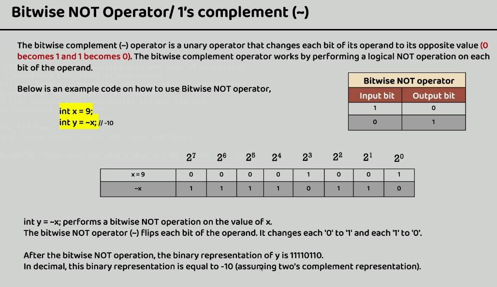
    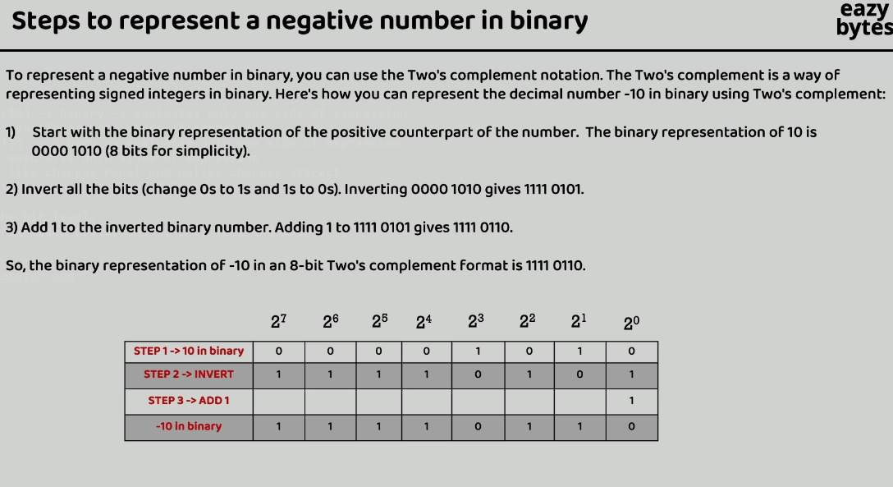

    - Bitwise AND operator

    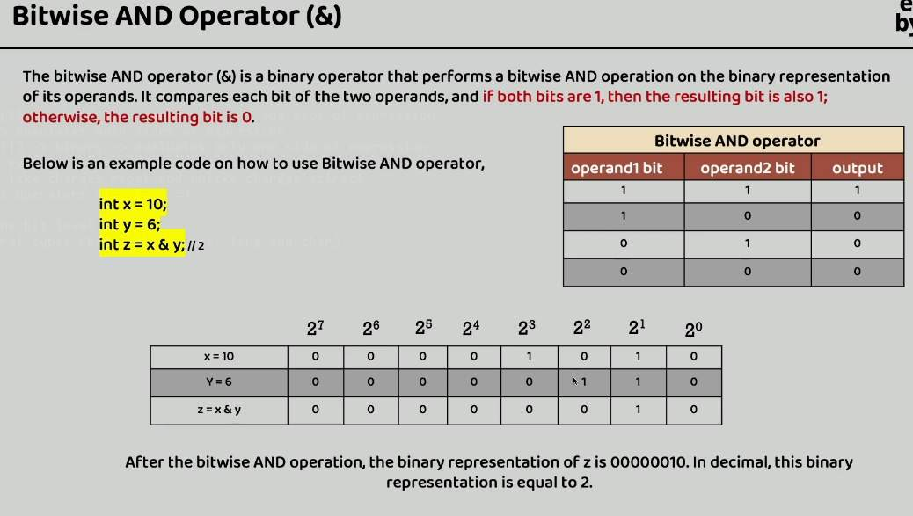

    - Bitwise OR operator
    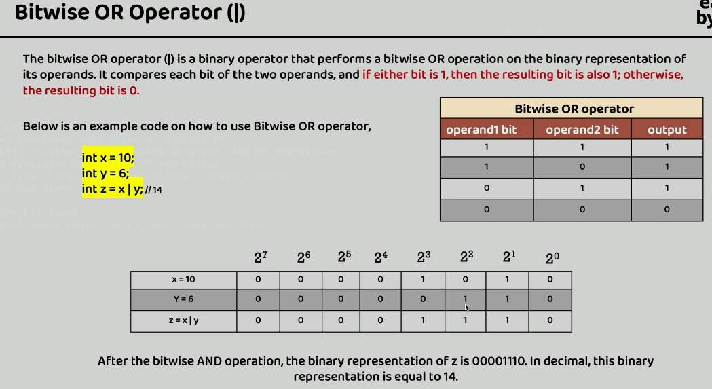

    - Bitwise XOR operator
    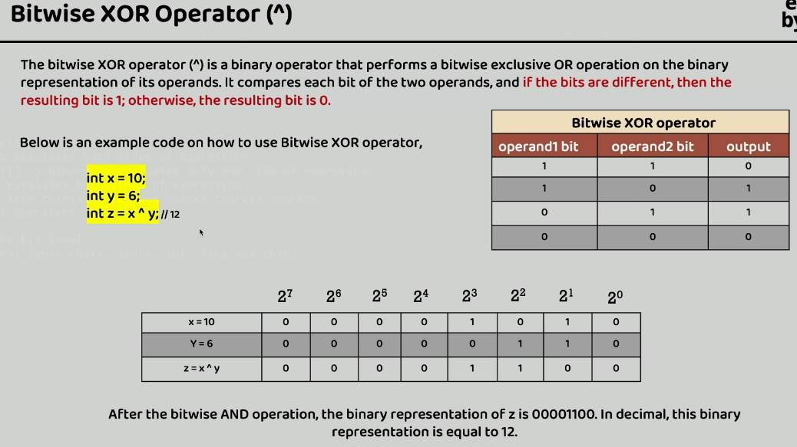

    - Left Shift operator
    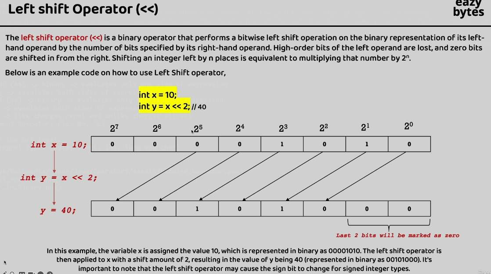
        - x * 2^n

    - Signed right shift operator(>>)
    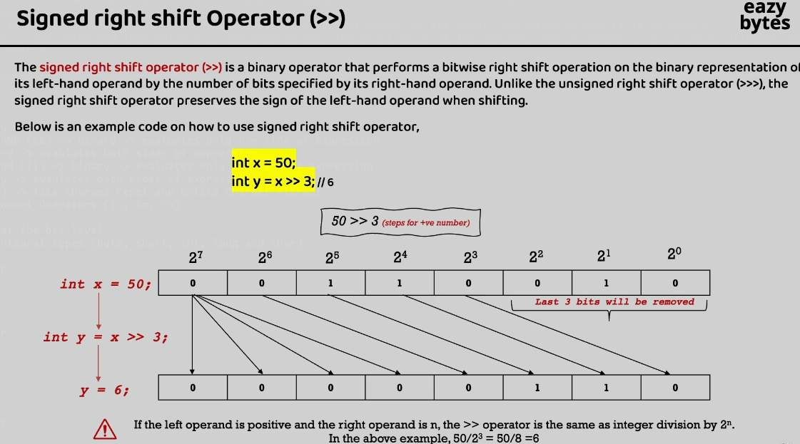
    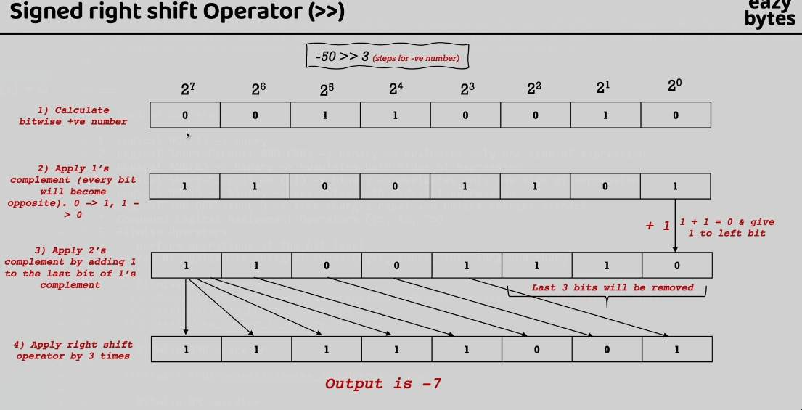

    - Unsigned right shift operator
    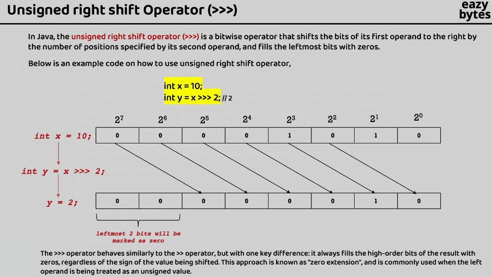

---
9. Compound assignment bitwise operators

    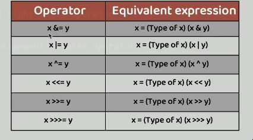
---

10. Ternary/ Compound operator

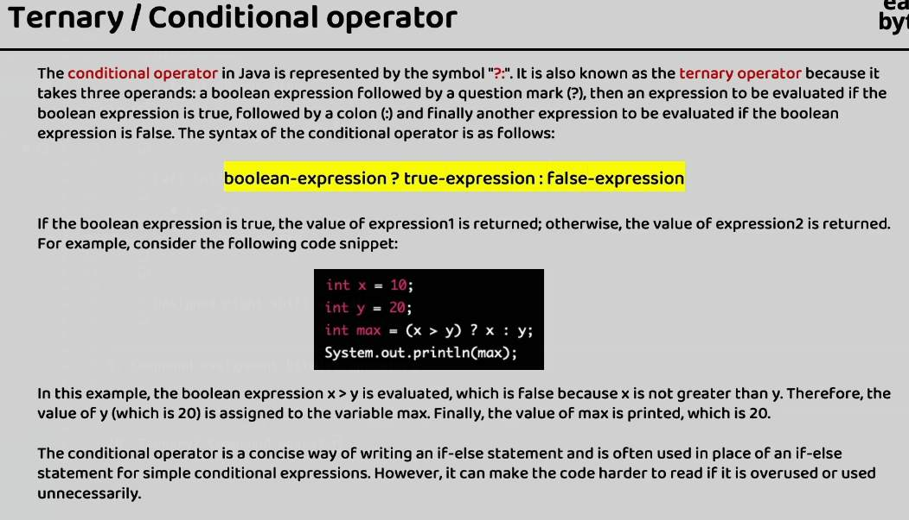

---

### Java Operators Precedence & Associativity


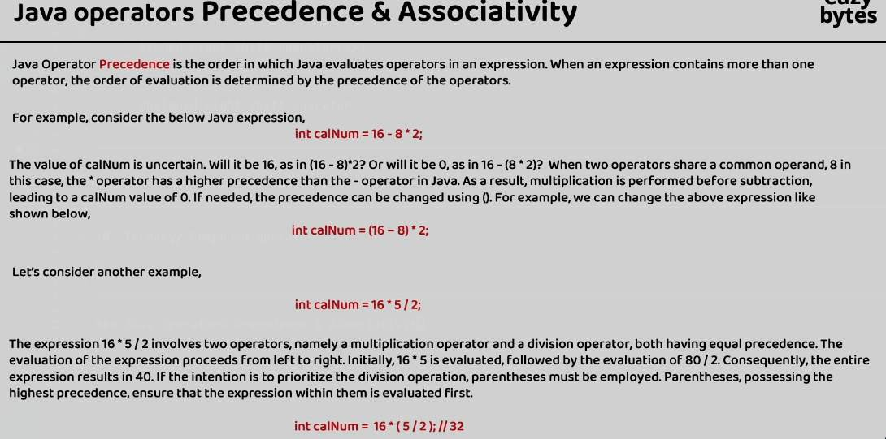

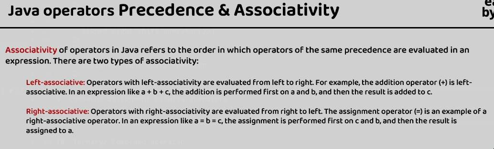

---

### Prcedence score


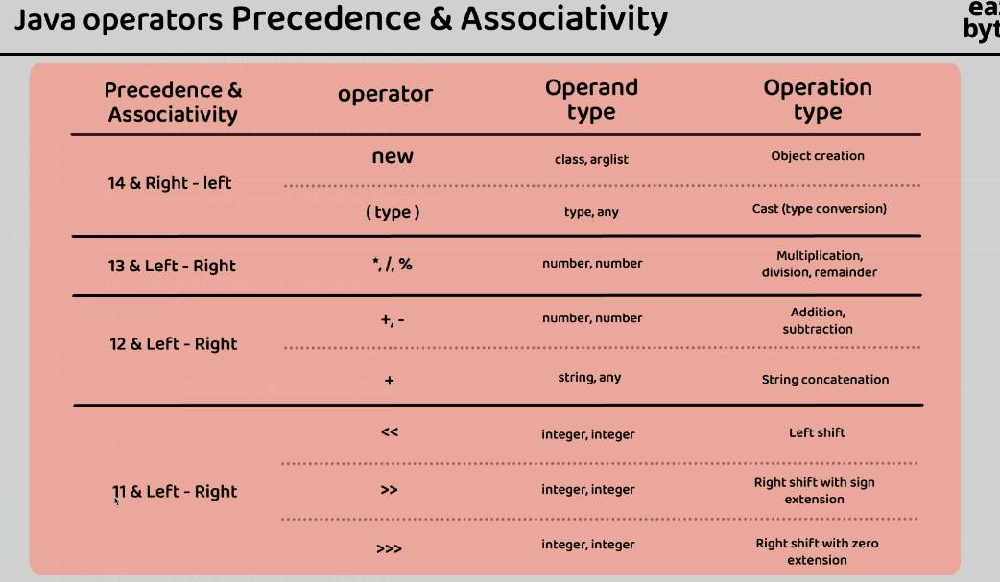

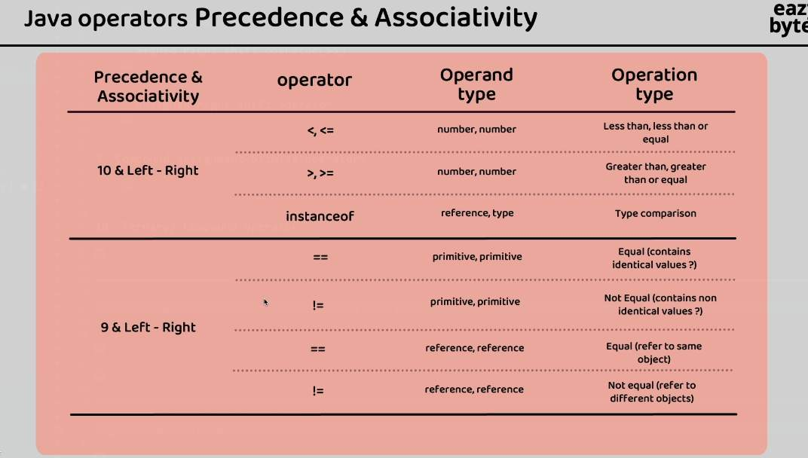

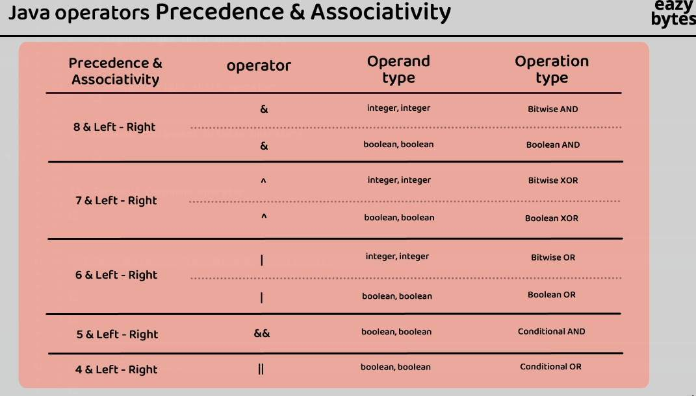

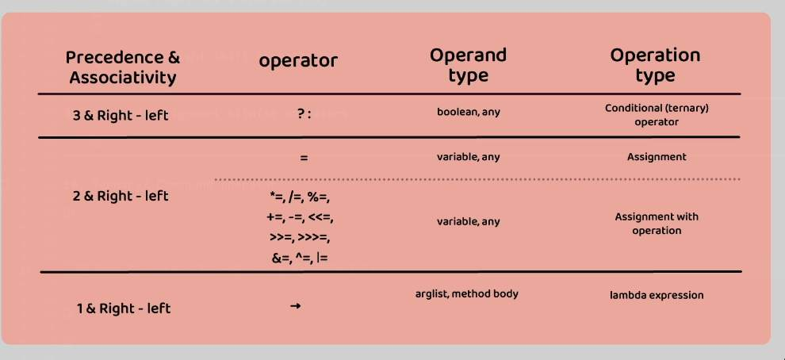
