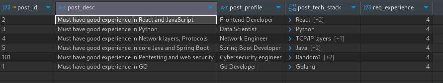

## Spring Data Rest

- With only Repository Layer we are able to perform CRUD operation
- Add spring-data-rest, spring-data-jpa dependency
```xml
<dependency>
	<groupId>org.springframework.boot</groupId>
	<artifactId>spring-boot-starter-data-jpa</artifactId>
</dependency>
<dependency>
	<groupId>org.springframework.boot</groupId>
	<artifactId>spring-boot-starter-data-rest</artifactId>
</dependency>
```

```java
// Model
@Data 
@AllArgsConstructor 
@NoArgsConstructor 
@Component
@Entity
public class JobPost {
	@Id
	private int postId;
	private String postProfile;
	private String postDesc;
	private int reqExperience;
	private List<String> postTechStack;
}

// Repository
@Repository
public interface JobRepo extends JpaRepository<JobPost, Integer> {

}
```

- From Postman when we hit the `GET http://localhost:8080/jobPosts`, we get this response
```json
{
    "_embedded": {
        "jobPosts": [
            {
                "postProfile": "Java Developer",
                "postDesc": "Must have good experience in core java",
                "reqExperience": 4,
                "postTechStack": [
                    "Java"
                ],
                "_links": {
                    "self": {
                        "href": "http://localhost:8080/jobPosts/1"
                    },
                    "jobPost": {
                        "href": "http://localhost:8080/jobPosts/1"
                    }
                }
            },
            {
                "postProfile": "Frontend Developer",
                "postDesc": "Must have good experience in React and JavaScript",
                "reqExperience": 4,
                "postTechStack": [
                    "React",
                    "JavaScript",
                    "TypeScript"
                ],
                "_links": {
                    "self": {
                        "href": "http://localhost:8080/jobPosts/2"
                    },
                    "jobPost": {
                        "href": "http://localhost:8080/jobPosts/2"
                    }
                }
            },
            {
                "postProfile": "Data Scientist",
                "postDesc": "Must have good experience in Python",
                "reqExperience": 4,
                "postTechStack": [
                    "Python"
                ],
                "_links": {
                    "self": {
                        "href": "http://localhost:8080/jobPosts/3"
                    },
                    "jobPost": {
                        "href": "http://localhost:8080/jobPosts/3"
                    }
                }
            },
            {
                "postProfile": "Network Engineer",
                "postDesc": "Must have good experience in Network layers, Protocols",
                "reqExperience": 4,
                "postTechStack": [
                    "TCP/IP layers",
                    "Networking"
                ],
                "_links": {
                    "self": {
                        "href": "http://localhost:8080/jobPosts/4"
                    },
                    "jobPost": {
                        "href": "http://localhost:8080/jobPosts/4"
                    }
                }
            },
            {
                "postProfile": "Spring Boot Developer",
                "postDesc": "Must have good experience in core Java and Spring Boot",
                "reqExperience": 4,
                "postTechStack": [
                    "Java",
                    "Spring Boot",
                    "Database"
                ],
                "_links": {
                    "self": {
                        "href": "http://localhost:8080/jobPosts/5"
                    },
                    "jobPost": {
                        "href": "http://localhost:8080/jobPosts/5"
                    }
                }
            },
            {
                "postProfile": "Cybersecurity engineer",
                "postDesc": "Must have good experience in Pentesting and web security",
                "reqExperience": 4,
                "postTechStack": [
                    "Random1",
                    "Random2",
                    "Random3"
                ],
                "_links": {
                    "self": {
                        "href": "http://localhost:8080/jobPosts/101"
                    },
                    "jobPost": {
                        "href": "http://localhost:8080/jobPosts/101"
                    }
                }
            }
        ]
    },
    "_links": {
        "self": {
            "href": "http://localhost:8080/jobPosts?page=0&size=20"
        },
        "profile": {
            "href": "http://localhost:8080/profile/jobPosts"
        }
    },
    "page": {
        "size": 20,
        "totalElements": 6,
        "totalPages": 1,
        "number": 0
    }
}
```

- The `_links` are from `Hatheos`
	- it is like, if you are providing with data, also provide with other data

### GET jobPost

```bash
curl --location 'http://localhost:8080/jobPosts/1'
```
```json
{
    "postProfile": "Java Developer",
    "postDesc": "Must have good experience in core java",
    "reqExperience": 4,
    "postTechStack": [
        "Java"
    ],
    "_links": {
        "self": {
            "href": "http://localhost:8080/jobPosts/1"
        },
        "jobPost": {
            "href": "http://localhost:8080/jobPosts/1"
        }
    }
}
```

### POST jobPosts 

```bash
curl --location 'http://localhost:8080/jobPosts' \
--header 'Content-Type: application/json' \
--data '{
    "postProfile": "Kotlin Developer",
    "postDesc": "Must have good experience in Kotlin",
    "reqExperience": 6,
    "postTechStack": [
        "Kotlin"
    ]
}'
```

```json
{
	"postProfile": "Kotlin Developer",
	"postDesc": "Must have good experience in Kotlin",
	"reqExperience": 6,
	"postTechStack": [
		"Kotlin"
	],
	"_links": {
		"self": {
			"href": "http://localhost:8080/jobPosts/0"
		},
		"jobPost": {
			"href": "http://localhost:8080/jobPosts/0"
		}
	}
}
```
- Updated in DB as well


### PUT jobPosts

```bash
curl --location --request PUT 'http://localhost:8080/jobPosts/1' \
--header 'Content-Type: application/json' \
--data '{
    "postProfile": "Go Developer",
    "postDesc": "Must have good experience in GO",
    "reqExperience": 4,
    "postTechStack": [
        "Golang"
    ]
}'
```

```json
// response
{
	"postProfile": "Go Developer",
	"postDesc": "Must have good experience in GO",
	"reqExperience": 4,
	"postTechStack": [
		"Golang"
	],
	"_links": {
		"self": {
			"href": "http://localhost:8080/jobPosts/1"
		},
		"jobPost": {
			"href": "http://localhost:8080/jobPosts/1"
		}
	}
}
```

- Updated in db as well



### DELETE jobPost

```bash
curl --location --request DELETE 'http://localhost:8080/jobPosts/4'
```

```json
{
	"postProfile": "Network Engineer",
	"postDesc": "Must have good experience in Network layers, Protocols",
	"reqExperience": 4,
	"postTechStack": [
		"TCP/IP layers",
		"Networking"
	],
	"_links": {
		"self": {
			"href": "http://localhost:8080/jobPosts/4"
		},
		"jobPost": {
			"href": "http://localhost:8080/jobPosts/4"
		}
	}
}
```
