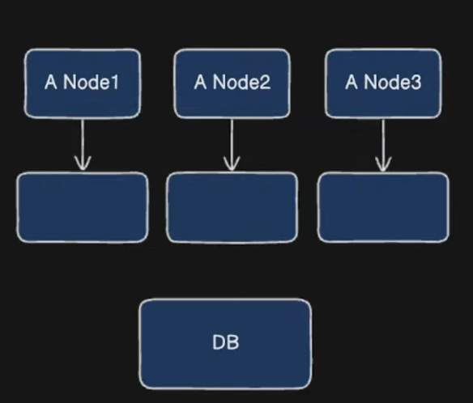
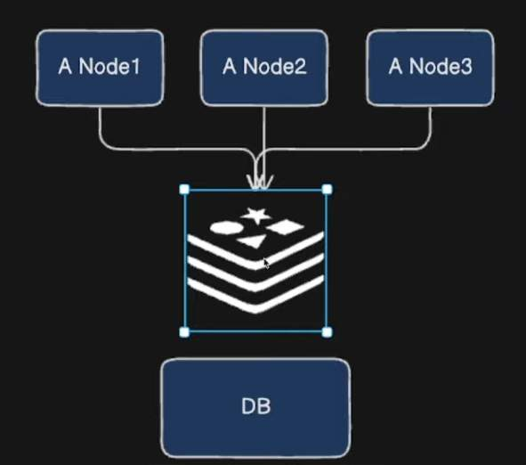

## Sprig Boot Caching

- What is a cache?
	- Storing frequently accessed data in a separate memory

---

- Why use Caching?
	- `Reduce Latency` - faster access to data compared to fetching from a database or an external service.
	- `Decrease load` - Reduces the number of call to the backend systems or database
	- `Improve Scalability` - Helps application handle higher traffic loads efficiently

---

### Types of Cache

1. In Memory cache
- Created inside the memory of the application
- Fine if we have one Node
	- if we scale horizontally and have more nodes alongside
	- each nodes will have a separate in memory cache
	- updates from one cache will not be there in all cache

	- Each nodes in memory cache can have different kind of data and it might lead to data inconsistency

2. Distributed Cache

- We have a separate system for caching which stores the data from all the nodes

---

### Annotations

### `@EnableCaching` 
-can be added above `Java based Configuration class` or `Main Class`

```Java
//Java based configuration class
@Configuration
@EnableCaching
public class AppConfig {

}

// or 
@SpringBootApplication
@EnableCaching
public class CachingdemoApplication {

	public static void main(String[] args) {
		SpringApplication.run(CachingdemoApplication.class, args);
	}

}
```

---

### `@Cacheable`
- We can use `@Cacheable("name")` on top of any method to cache the output of this method

```Java
@GetMapping("/weather")
public ResponseEntity<?> getWeather(@RequestParam String city) {
	Optional<Weather> weather = weatherService.getWeather(city);
	if (weather.isEmpty()) {
		return ResponseEntity.status(HttpStatus.NOT_FOUND).body("Not found");
	}
	return ResponseEntity.ok(weather.get());
}

@Cacheable("weather")
public Optional<Weather> getWeather(String city) {
	log.info("Fetching from db for city: ,{}", city);
	return weatherRepository.findByCity(city);
}
```
- When we try to send the same request again, spring boot uses the cache to fetch the data.
- From the logs we can see the select query is triggered only once

```bash
GET /weather?city=Morocco HTTP/1.1
Host: localhost:8080
```

```logs
026-05-08T22:42:18.053+05:30  INFO 118651 --- [cachingdemo] [nio-8080-exec-2] o.s.web.servlet.DispatcherServlet        : Initializing Servlet 'dispatcherServlet'
2026-05-08T22:42:18.054+05:30  INFO 118651 --- [cachingdemo] [nio-8080-exec-2] o.s.web.servlet.DispatcherServlet        : Completed initialization in 1 ms
2026-05-08T22:42:18.079+05:30  INFO 118651 --- [cachingdemo] [nio-8080-exec-2] c.e.cachingdemo.service.WeatherService   : Fetching from db for city: ,Morocco
Hibernate: select w1_0.id,w1_0.city,w1_0.forecast from weather w1_0 where w1_0.city=?
```

- Cache is storing the data in `ConcurrentHashMap` data structure

```Java
@Service
@Slf4j
public class CacheInspectionService {

	@Autowired
	private CacheManager cacheManger;

	public void printCacheContent(String cacheName) {
		Cache cache = cacheManger.getCache(cacheName);
		if (cache != null) {
			log.info("Cache Contents: {}", Objects.requireNonNull(cache.getNativeCache()).toString());
		} else {
			log.info("No such cache: " + cacheName);
		}
	}

}

// Controller
@GetMapping("/cacheData")
public void getData() {
	cacheInspectionService.printCacheContent("weather");
}
```


```bash
GET /cacheData HTTP/1.1
Host: localhost:8080
Authorization: Basic VGVzdDE6MTIzNA==
```

```logs
2026-05-08T23:11:52.899+05:30  INFO 121676 --- [cachingdemo] [nio-8080-exec-1] c.e.cachingde
mo.service.WeatherService   : Fetching from db for city: ,Morocco
Hibernate: select w1_0.id,w1_0.city,w1_0.forecast from weather w1_0 where w1_0.city=?
2026-05-08T23:12:57.535+05:30  INFO 121676 --- [cachingdemo] [nio-8080-exec-5] c.e.c.service
.CacheInspectionService     : Cache Contents: {Morocco=Weather(id=1, city=Morocco, forecast=
Rainy)}
```

```debug logs
- cache ConcurrentMapCache = ConcurrentMapCache@83
   allowNullValues boolean = true
  name String = "weather"
   serialization null = null
  store ConcurrentHashMap = ConcurrentHashMap@88 size=1
   0 ConcurrentHashMap$MapEntry = ConcurrentHashMap$MapEntry@129
     = ConcurrentHashMap$MapEntry@129 "Morocco":"Weather(id=1, city=Morocco, forecast=Rainy)"
     key String = "Morocco"
       coder byte = 0
       hash int = -1390138320
       hashIsZero boolean = false
      value byte[] = byte[7]@119
     value Weather = Weather@109
       = Weather@109 "Weather(id=1, city=Morocco, forecast=Rainy)"
```

---

### `@CachePut`
- Will save the data in database and update update the cache as well
- Say for example we have used `@Cacheble` and the data is already stored in the cache after `GET` calls
- Now, we update the data in db and try to fetch this updated value using another `GET` call, we get the previous data which is not updated. To solve this we need to use `@CachePut` on top of the `updateMethod`

```Java
// Controller
@PutMapping("/weather/{city}")
public ResponseEntity<?> updateWeather(@PathVariable String city, @RequestParam String updatedWeather) {
	log.info("PathVariable: {}, RequestParam: {}", city, updatedWeather);
	Optional<Weather> weather3 = weatherService.updateWeather(city, updatedWeather);
	if (weather3 == null) {
		return ResponseEntity.status(HttpStatus.BAD_REQUEST).body("Could not modify Resource");
	}
	return new ResponseEntity<>(weather3.get(), HttpStatus.CREATED);
}


// Service without `@CachePut`
public Optional<Weather> updateWeather(String city, String updatedWeather) {

	Optional<Weather> existingWeather = weatherRepository.findByCity(city);

	if (existingWeather.isEmpty()) {
		return Optional.empty();
	}

	Weather wetherToUpdate = existingWeather.get();

	wetherToUpdate.setForecast(updatedWeather);

	Weather savedWeather = weatherRepository.save(wetherToUpdate);

	return Optional.of(savedWeather);
}
```
```bash
PUT /weather/Russia?updatedWeather=Snowy HTTP/1.1
Host: localhost:8080
```

```json
{
	"id": 7,
	"city": "Russia",
	"forecast": "Snowy"
}
```
- The value in h2 database is updated

```bash
GET /weather?city=Russia HTTP/1.1
Host: localhost:8080
```

```json
{
	"id": 7,
	"city": "Russia",
	"forecast": "Cloudy"
}
```

- Before using `@CachePut`
- From the debug logs we can still see that even after updating Weather for `Russia`, during the `GET` call we still get `Cloudy` because it is directly fetched from `In memory Cache`
- We can verify this after hitting the `cacheCotnent` endpoint

```bash
GET /cacheData HTTP/1.1
Host: localhost:8080
```

```logs
2026-05-09T19:31:14.757+05:30  INFO 16623 --- [cachingdemo] [nio-8080-exec-8] c.e.c.service.CacheInspectionService     : Cache Contents: {Russia=Weather(
id=7, city=Russia, forecast=Cloudy)}
```

```debug logs
 cache ConcurrentMapCache = ConcurrentMapCache@84
   allowNullValues boolean = true
  name String = "weather"
   serialization null = null
  store ConcurrentHashMap = ConcurrentHashMap@93 size=1
   0 ConcurrentHashMap$MapEntry = ConcurrentHashMap$MapEntry@143
     = ConcurrentHashMap$MapEntry@143 "Russia":"Weather(id=7, city=Russia, forecast=Cloudy)"
     key String = "Russia"
       coder byte = 0
       hash int = -1835785125
       hashIsZero boolean = false
      value byte[] = byte[6]@122
     value Weather = Weather@112
       = Weather@112 "Weather(id=7, city=Russia, forecast=Cloudy)"
       city String = "Russia"
       forecast String = "Cloudy"
       id Long = Long@134
```
- After using `@CachePut` on the update method in `Service` class

```java
@CachePut("weather")
public Optional<Weather> updateWeather(String city, String updatedWeather) {

	Optional<Weather> existingWeather = weatherRepository.findByCity(city);
	if (existingWeather.isEmpty()) {
		return Optional.empty();
	}
	Weather wetherToUpdate = existingWeather.get();
	wetherToUpdate.setForecast(updatedWeather);
	Weather savedWeather = weatherRepository.save(wetherToUpdate);
	return Optional.of(savedWeather);
}
```
- We use a `GET` call two times so that the value is stored in cache
```bash
GET /weather?city=Russia HTTP/1.1
Host: localhost:8080
```
```json
{
	"id": 7,
	"city": "Russia",
	"forecast": "Snowy"
}
```

- Now, we update the city's weather using `PUT` call

```bash
PUT /weather/Russia?updatedWeather=Rainy HTTP/1.1
Host: localhost:8080
```

```json
{
	"id": 7,
	"city": "Russia",
	"forecast": "Rainy"
}
```
- The database is update as well

- Again, while we check for the updated value using the `GET` call we still won't get the updated value

```bash
GET /weather?city=Russia HTTP/1.1
Host: localhost:8080
```

```json
{
	"id": 7,
	"city": "Russia",
	"forecast": "Snowy"
}
```

- We get the old value.
- In the `GET` call `cacheCotnent` we can see that there is a new entry in the `ConcurrentHashMap` with `SimpleKey` for this updated value
- logs also show the same
```java
2026-05-09T19:38:59.855+05:30  INFO 19668 --- [cachingdemo] [nio-8080-exec-6] c.e.c.service.CacheInspectionService    
 : Cache Contents: {Russia=Weather(id=7, city=Russia, forecast=Snowy), SimpleKey [Russia, Rainy]=Weather(id=7, city=Ru
ssia, forecast=Rainy)}
```


```debug logs
 cache ConcurrentMapCache = ConcurrentMapCache@83
   allowNullValues boolean = true
  name String = "weather"
   serialization null = null
  store ConcurrentHashMap = ConcurrentHashMap@88 size=2
   0 ConcurrentHashMap$MapEntry = ConcurrentHashMap$MapEntry@145
     = ConcurrentHashMap$MapEntry@145 "Russia":"Weather(id=7, city=Russia, forecast=Snowy)"
     key String = "Russia"
       coder byte = 0
       hash int = -1835785125
       hashIsZero boolean = false
      value byte[] = byte[6]@110
     value Weather = Weather@106
       = Weather@106 "Weather(id=7, city=Russia, forecast=Snowy)"
       city String = "Russia"
       forecast String = "Snowy"
       id Long = Long@115
   1 ConcurrentHashMap$MapEntry = ConcurrentHashMap$MapEntry@146
     = ConcurrentHashMap$MapEntry@146 "SimpleKey [Russia, Rainy]":"Weather(id=7, city=Russia, forecast=Rainy)"
     key SimpleKey = SimpleKey@123
     value Weather = Weather@124
       = Weather@124 "Weather(id=7, city=Russia, forecast=Rainy)"
       city String = "Russia"
       forecast String = "Rainy"
       id Long = Long@115
```

- The cache is returning the old value
- We can use the `key` attribute in `@Cacheble` and `@CachePut` along with `value`
- So the new signature becomes

```java
@Cacheable(value = "weather", key = "#city")
public Optional<Weather> getWeather(String city) {
	log.info("Fetching from db for city: ,{}", city);
	return weatherRepository.findByCity(city);
}

public Weather addWeather(Weather weather) {
	return weatherRepository.save(weather);
}

@CachePut(value = "weather", key = "#city")
public Optional<Weather> updateWeather(String city, String updatedWeather) {

	Optional<Weather> existingWeather = weatherRepository.findByCity(city);
	if (existingWeather.isEmpty()) {
		return Optional.empty();
	}
	Weather wetherToUpdate = existingWeather.get();
	wetherToUpdate.setForecast(updatedWeather);
	Weather savedWeather = weatherRepository.save(wetherToUpdate);
	return Optional.of(savedWeather);
}
```

> [!NOTE]
> The `weather` entity will be used a `key` of the `ConcurrentHashMap` and it will be similar everywhere

```bash
GET /weather?city=United Kingdom HTTP/1.1
Host: localhost:8080
```

```json
{
	"id": 2,
	"city": "United Kingdom",
	"forecast": "Cloudy"
}
```

```bash
PUT /weather/United Kingdom?updatedWeather=Rainy HTTP/1.1
Host: localhost:8080
```

```json
{
	"id": 2,
	"city": "United Kingdom",
	"forecast": "Rainy"
}
```

```bash
GET /cacheData HTTP/1.1
Host: localhost:8080
```

```json
{United Kingdom=Weather(id=2, city=United Kingdom, forecast=Rainy)}
```

```debug logs

 cache ConcurrentMapCache = ConcurrentMapCache@83
   allowNullValues boolean = true
  name String = "weather"
   serialization null = null
  store ConcurrentHashMap = ConcurrentHashMap@88 size=1
   0 ConcurrentHashMap$MapEntry = ConcurrentHashMap$MapEntry@101
     = ConcurrentHashMap$MapEntry@101 "United Kingdom":"Weather(id=2, city=United Kingdom, forecast=Cloudy)"
     key String = "United Kingdom"
       coder byte = 0
       hash int = -1691889586
       hashIsZero boolean = false
      value byte[] = byte[14]@109
     value Weather = Weather@105
       = Weather@105 "Weather(id=2, city=United Kingdom, forecast=Cloudy)"
       city String = "United Kingdom"
       forecast String = "Cloudy"
       id Long = Long@114
```

- We have only one entry in `ConcurrentHashMap`

---

### `@CacheEvict`

```java
@Transactional
@CacheEvict(value = "weather", key = "#city")
public boolean deleteWeather(String city) {
	if (weatherRepository.findByCity(city) == null) {
		return false;
	}

	weatherRepository.deleteByCity(city);
	return true;
}
```

- Will delete from cache also

---
