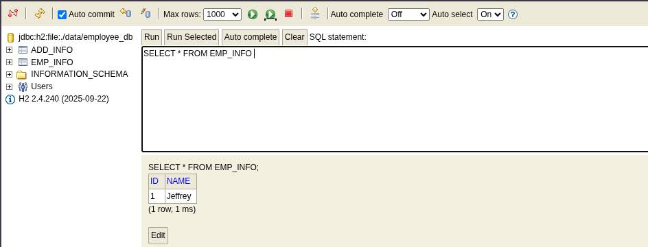
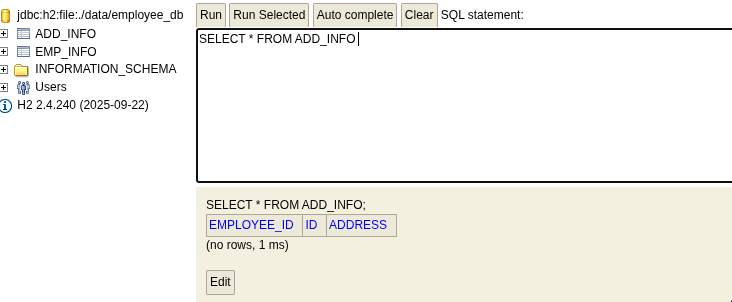

## Transaction

- Transactions ensure that multiple database operations are executed as a single unit, maintaining data consistency and integrity. In Spring Boot, transaction management is simplified using @Transactional, which automatically handles commit and rollback operations.

- Ensures all-or-nothing execution (commit or rollback) of operations
- Uses @Transactional to automate transaction handling
- Either on `Class level` or `Method level`
- Eliminates manual transaction management code

---

### Transaction management

- Transaction management is the process of coordinating database operations to follow the ACID properties:

1.Atomicity: All or nothing.
2.Consistency: Database remains valid before and after transaction.
3.Isolation: Concurrent transactions do not affect each other.
4.Durability: Changes persist even after system failures.

- Example: In a banking system, if you transfer money:
	- Debit amount from one account.
	- Credit amount to another account.
	- Both operations should succeed or fail together.

---

### The @Transactional annotation:

- Automatically starts a transaction when a method is called.
- Commits the transaction if the method completes successfully.
- Rolls back the transaction if a runtime exception occurs.
- Reduces boilerplate transaction-handling code.

> [!NOTE]
> If you use spring-boot-starter-data-jpa, Spring Boot auto-configures transaction management, so @EnableTransactionManagement isn’t required. Add it only if you’re not using JPA starter or need custom transaction management.

- The annotation supports further configuration as well:

	- the **Propagation Type** of the transaction
	- the **Isolation Level** of the transaction
	- a **Timeout** for the operation wrapped by the transaction
	- a **readOnly flag** – a hint for the persistence provider that the transaction should be read only
	- the **Rollback rules** for the transaction

> [!NOTE]
> By default, rollback happens for runtime, unchecked exceptions only. The checked exception does not trigger a rollback of the transaction. We can, of course, configure this behavior with the rollbackFor and noRollbackFor annotation parameters.

---

- First of all, without `@Transactional` annotation if in case we encounter any Exception or anything else there might be in consistency in the data stored in the db 
- Consider below example, we intentionally set the `Address` object to null
```java
// Entity
@Entity
@Data
@AllArgsConstructor
@NoArgsConstructor
@Table(name = "emp_info")
public class Employee {
	@Id
	@GeneratedValue(strategy = GenerationType.IDENTITY)
	private Long id;
	private String name;
}

// Controller
@RestController
public class EmployeeController {

	@Autowired
	private EmployeeService employeeService;

	@PostMapping("/employee")
	public ResponseEntity<?> addEmployee(@RequestBody Employee employee) {
		try {
			Employee savedEmployee = employeeService.addEmpolyee(employee);
			return ResponseEntity.ok(savedEmployee);
		} catch (Exception e) {
			return ResponseEntity.badRequest().body("Transaction failed " + e.getMessage());
		}
	}

}

// Service
@Service
@Slf4j
public class EmployeeService {

	@Autowired
	private EmployeeRepository employeeRepository;

	@Autowired
	private AddressService addressService;

	public Employee addEmpolyee(Employee employee) {
		log.info("Employee: {}", employee);
		Employee employeeSavedToDB = employeeRepository.save(employee);

		// Address address = new Address();
		Address address = null;
		address.setId(123L);
		address.setAddress("London");
		address.setEmployee(employee);

		// This may throw an exception intentionally for testing rollback
		if (employee.getName().equalsIgnoreCase("error")) {
			throw new RuntimeException("Simulated Exception: Forcing rollback!");
		}

		this.addressService.addAddress(address);
		log.info("Address: {}", address);
		log.info("Employee details saved successfully");
		return employeeSavedToDB;
	}
}
```

- When we try add the employee, because of null address object only employee table is added with data and address table to be not filled with data.

```bash
POST /employee HTTP/1.1
Host: localhost:8080
Content-Type: application/json
Content-Length: 25

{
    "name": "Jeffrey"
}
```

```json
Transaction failed Cannot invoke "com.example.Transaction.entity.Address.setId(java.lang.Long)" because "address" is null
```

- from the database we can see 





- If we use a `@Transactional`, the transaction will be rolled back because `rollbackFor = Exception.class` attribute and the employee table also will not be updated
```java
@Service
@Slf4j
public class EmployeeService {

	@Autowired
	private EmployeeRepository employeeRepository;

	@Autowired
	private AddressService addressService;

	@Transactional(rollbackFor = Exception.class)
	public Employee addEmpolyee(Employee employee) {
		log.info("Employee: {}", employee);
		Employee employeeSavedToDB = employeeRepository.save(employee);

		// Address address = new Address();
		Address address = null;
		address.setId(123L);
		address.setAddress("London");
		address.setEmployee(employee);

		// This may throw an exception intentionally for testing rollback
		if (employee.getName().equalsIgnoreCase("error")) {
			throw new RuntimeException("Simulated Exception: Forcing rollback!");
		}

		this.addressService.addAddress(address);
		log.info("Address: {}", address);
		log.info("Employee details saved successfully");
		return employeeSavedToDB;
	}
}
```

- This way the spring has handled the transaction that both employees and address data gets stored or no data gets stored.

---

### Transactions and Proxies

- At a high level, Spring creates proxies for all the classes annotated with @Transactional, either on the class or on any of the methods. The proxy allows the framework to inject transactional logic before and after the running method, mainly for starting and committing the transaction.

- What’s important to keep in mind is that, if the transactional bean is implementing an interface, by default the proxy will be a Java Dynamic Proxy. This means that only external method calls that come in through the proxy will be intercepted. Any self-invocation calls will not start any transaction, even if the method has the @Transactional annotation.

- Another caveat of using proxies is that only public methods should be annotated with @Transactional. Methods of any other visibilities will simply ignore the annotation silently as these are not proxied.

### Changing the Isolation Level

`courseDao.createWithRuntimeException(course);`
- We can also change the transaction isolation level:

`@Transactional(isolation = Isolation.SERIALIZABLE)`
- Note that this has actually been introduced in Spring 4.1; if we run the above example before Spring 4.1, it will result in:

- `org.springframework.transaction.InvalidIsolationLevelException: Standard JPA does not support custom isolation levels – use a special JpaDialect for your JPA implementation`

### Read-Only Transactions

- The readOnly flag usually generates confusion, especially when working with JPA. From the Javadoc:

- `This just serves as a hint for the actual transaction subsystem; it will not necessarily cause failure of write access attempts. A transaction manager which cannot interpret the read-only hint will not throw an exception when asked for a read-only transaction.`

- The fact is that we can’t be sure that an insert or update won’t occur when the readOnly flag is set. This behavior is vendor-dependent, whereas JPA is vendor agnostic.

- It’s also important to understand that the readOnly flag is only relevant inside a transaction. If an operation occurs outside of a transactional context, the flag is simply ignored. A simple example of that would call a method annotated with:

- `@Transactional(propagation = Propagation.SUPPORTS, readOnly = true)`

- From a non-transactional context, a transaction will not be created and the readOnly flag will be ignored.

### Transaction Logging

- A helpful method to understand transactional-related issues is fine-tuning logging in the transactional packages. The relevant package in Spring is “org.springframework.transaction”, which should be configured with a logging level of TRACE.

### Transaction Rollback

- The @Transactional annotation is the metadata that specifies the semantics of the transactions on a method. We have two ways to rollback a transaction: declarative and programmatic.

- In the declarative approach, we annotate the methods with the @Transactional annotation. The @Transactional annotation makes use of the attributes `rollbackFor` or `rollbackForClassName` to rollback the transactions, and the attributes `noRollbackFor` or `noRollbackForClassName` to avoid rollback on listed exceptions.

- The default `rollback behavior` in the `declarative approach` will rollback on `runtime exceptions`.

- Let’s see a simple example using the declarative approach to rollback a transaction for runtime exceptions or errors:

```java
@Transactional
public void createCourseDeclarativeWithRuntimeException(Course course) {
	courseDao.create(course);
	throw new DataIntegrityViolationException("Throwing exception for demoing Rollback!!!");
}
```

- Next, we’ll use the declarative approach to rollback a transaction for the listed checked exceptions. The rollback in our example is on SQLException:

```java
@Transactional(rollbackFor = { SQLException.class })
public void createCourseDeclarativeWithCheckedException(Course course) throws SQLException {
	courseDao.create(course);
	throw new SQLException("Throwing exception for demoing rollback");
}
```

- Let’s see a simple use of attribute noRollbackFor in the declarative approach to prevent rollback of the transaction for the listed exception:

```java
@Transactional(noRollbackFor = { SQLException.class })
public void createCourseDeclarativeWithNoRollBack(Course course) throws SQLException {
	courseDao.create(course);
	throw new SQLException("Throwing exception for demoing rollback");
}
```

- In the programmatic approach, we rollback the transactions using TransactionAspectSupport:

```java
public void createCourseDefaultRatingProgramatic(Course course) {
	try {
		courseDao.create(course);
	} catch (Exception e) {
		TransactionAspectSupport.currentTransactionStatus().setRollbackOnly();
	}
}
```

- The declarative rollback strategy should be favored over the programmatic rollback strategy.

---
