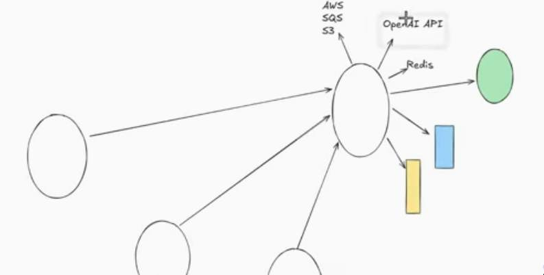
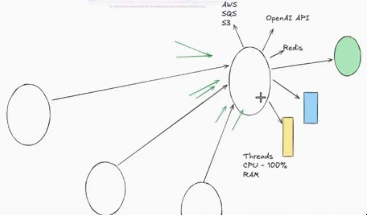
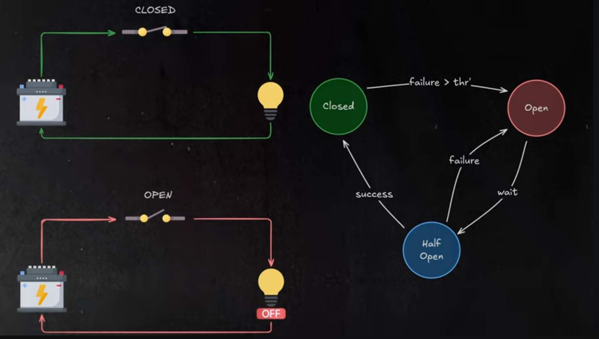
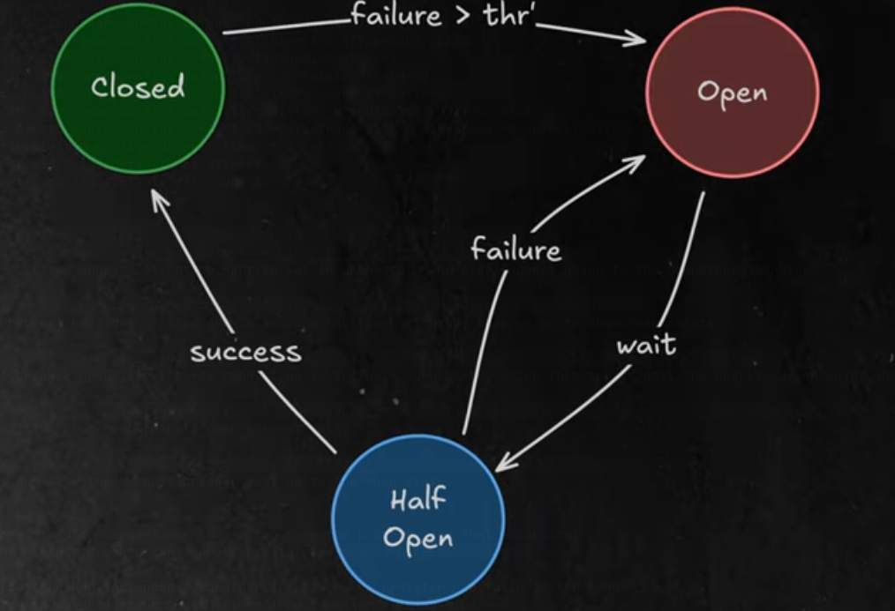

## Circuit Breaker in Springboot Microservices





- Destination server is already overloaded, and performing in slow manner
- When invoker services, are calling such affected destination service.. the invoker services will also face issue


1. S1 is calling S2
2. S2 start with low performance, or not proper responses.
3. S1 should identify that S2 is not behaving properly(problem with s2)
4. S1 stops calling destination service S2, Rather S1 assumes destination is not available, and directly assumes failure.
5. In S1 logic, failure handling will be triggered.

	- S1 is not waiting on S2, S1 will not slow down.
	- S1 is not adding more load on S2. So S2 gets time to recover


- 2nd part -> CB
- for how long S1 should not call S2.
	- 60s, 2min, 3min, 5min

1. S1 will stop calling S2. CB logic
2. S1 will assume failure. For configured amount of time (2mins)
3. After 2mins, S1 will call S2, to check if S2 is working properly
4.1 S2 is ok
	- S1 will start calling S2 regularly for all API calls
4.2 S2 is still having some problem
	- S1 will again default assume failure, and stop calling S2, for another 2mins time.

- There is a library called as `Resillience4J` using which we can implement circuit breaker
	- `pom` dependency
	- property file

- Circuit breaker have status
1. CLOSED -> S1 calls S2 regularly
2. OPEN -> S1 stops calling S2, it breaks the circuit, and assumes failure
3. HALF OPEN -> where S1 check if S2 is working up or not

Three kinds of Jar dependencies

- Resillience4J - Circuit breaker

- AOP - Aspect oriented programming -> Jar of this AOP is required
	- before and after your method, some additional logic can be executed using AOP 

- Actuators
	- Health monitoring


### Additionals



- Default and instance based properties for Circuit breaker

```properties
# Actuator Endpoints
#
management.endpoints.web.exposure.include=*
management.endpoints.health.show.details=always

# Circut Breaker configuration for 'getWeatherCircuitBreaker'
# This is instance level configuration
resilience4j.circuitbreaker.instances.getWeatherCircuitBreaker.register-health-indicator=true
resilience4j.circuitbreaker.instances.getWeatherCircuitBreaker.sliding-window=5
resilience4j.circuitbreaker.instances.getWeatherCircuitBreaker.failure-rate-threshold=50
resilience4j.circuitbreaker.instances.getWeatherCircuitBreaker.wait-duration-in-open-state=10s
resilience4j.circuitbreaker.instances.getWeatherCircuitBreaker.permitted-number-of-calls-in-half-open-state=2
resilience4j.circuitbreaker.instances.getWeatherCircuitBreaker.minimum-number-of-calls=5
resilience4j.circuitbreaker.instances.getWeatherCircuitBreaker.automatic-transition-from-open-to-half-open-enabled=true
resilience4j.circuitbreaker.instances.getWeatherCircuitBreaker.slow-call-rate-threshold=100
resilience4j.circuitbreaker.instances.getWeatherCircuitBreaker.slow-call-duration-threshold=2s

# we can also have default configuration like this
# Resilience4j properties
# resilience4j.circuitbreaker.configs.default.registerHealthIndicator=true 
# resilience4j.circuitbreaker.configs.default.slidingWindowType=COUNT_BASED
# resilience4j.circuitbreaker.configs.default.slidingWindowSize=8
# resilience4j.circuitbreaker.configs.default.failureRateThreshold=50
# resilience4j.circuitbreaker.configs.default.minimum-number-of-calls=5
# resilience4j.circuitbreaker.configs.default.permittedNumberOfCallsInHalfOpenState=2
# resilience4j.circuitbreaker.configs.default.automaticTransitionFromOpenToHalfOpenEnabled=true
# resilience4j.timelimiter.configs.default.timeout-duration=3s
# resilience4j.retry.configs.default.max-attempts=3
# resilience4j.retry.configs.default.wait-duration=2s
```


- `resilience4j.circuitbreaker.instances.getWeatherCircuitBreaker.sliding-window=5`
- `resilience4j.circuitbreaker.instances.getWeatherCircuitBreaker.failure-rate-threshold=50`
	- if 50% of last five request failed, we want to set an open state and stop request going to the downstream service

- `resilience4j.circuitbreaker.instances.getWeatherCircuitBreaker.wait-duration-in-open-state=10s`
	- if no other request have been failed and 10 seconds have been elapsed, then we go to the closed state 

- `resilience4j.circuitbreaker.instances.getWeatherCircuitBreaker.permitted-number-of-calls-in-half-open-state=2`
	- when circuit breaker opens, we let few request go to the half open state, which then try to call the downstream endpoint and that's to check whether downstream is backup or not.
- `resilience4j.circuitbreaker.instances.getWeatherCircuitBreaker.automatic-transition-from-open-to-half-open-enabled=true`
	- enables transition from open to half open automatically 

- `resilience4j.circuitbreaker.instances.getWeatherCircuitBreaker.slow-call-duration-threshold=2s`
	- if the calls are slow the circuit breaker will go to the open state


- we can have more circuit breakers and the we can have the property for that accordingly
- This is for the circuit breaker configuration with name `getWeatherCircuitBreaker`
```properties
resilience4j.circuitbreaker.instances.getWeatherCircuitBreaker.register-health-indicator=true
resilience4j.circuitbreaker.instances.getWeatherCircuitBreaker.sliding-window=5
resilience4j.circuitbreaker.instances.getWeatherCircuitBreaker.failure-rate-threshold=50
```

- We can change the name to set property for a particular circuit breaker



