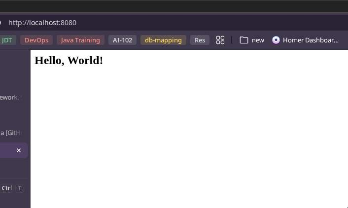
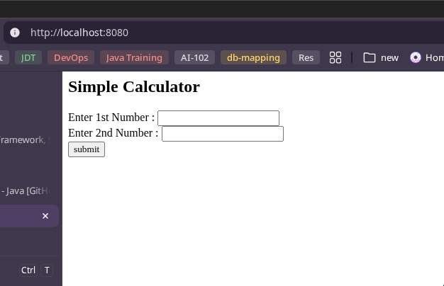
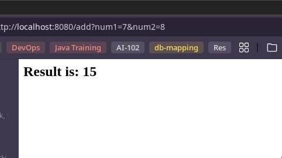
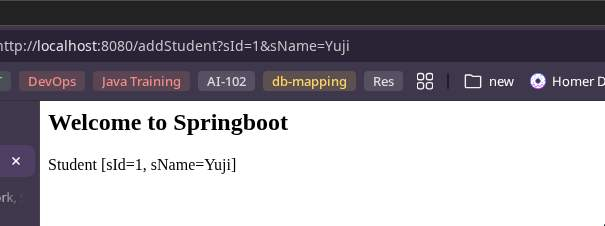
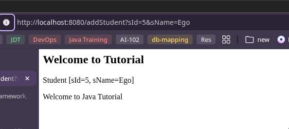

### MVC with Spring Boot 

- Create a plain spring-boot project using [Spring Initializer](https://start.spring.io) or using `spring cli`
```bash
 spring init \
  --build=maven \
  --java-version=21 \
  --dependencies=web,dep1,... \
  nameOfSpringprject 
```
- 

- Inside `main` directory create a folder named `webapp` and create a file named `index.jsp` which will be searched by the spring
```
- main/
	- java/
	- resources/
	- webapp/index.jsp
```
- Spring will look for `webapp` directory for the `homepage`
```jsp
<%@page language="java" %>
<html>
	<body>
		<h2>Hello, World!</h2>
	</body>
</html>
```
- Run the `spring boot` application, the default port will be 8080
- Still if we load the `localhost:8080` we still won't get the contents in `index.jsp`
- This is because
	- The `Controller` tells the `jsp` to show the contents

### Creating a `Controller`
- We use annotation `@Controller` which is a `stereotype` object to define a class as `Controller`
- Now behind the scene, `@Controller` will convert the code into `Servlet` and that works in tomcat
```java
@Controller
public class HomeController {

	public String home() {
		return "index.jsp";
	}

}
```
- If we do this and restart the application still we won't be able to get the index.jsp to work
- because there is no mapping, like previously in `Servlets` we used `context.addServletMappingDemo(uri:, nameOfServlet:)`
- here also we have to map that uri to this `home()` function.

- `@RequestMapping` -> to map the request
	- we have many methods
```java
@Controller
public class HomeController {
	@RequestMapping("/")
	public String home() {
		return "index.jsp";
	}
}
```
- By default spring boot does not support jsp, we have to convert jsp into servlet
	- for this we have to use `Tomcat Jasper`
	- we can add this maven dependency
```xml
<dependency>
	<groupId>org.apache.tomcat</groupId>
	<artifactId>tomcat-jasper</artifactId>
	<version>11.0.18</version>
	<scope>compile</scope>
</dependency>
```
> [!NOTE]
> use the same version as `embedded tomcat core` dependency version

- now we are able to see the jsp page

---
### Accepting data the servlet way

- To test the data is moved from controller to jsp
- we create a new page in `index.jsp` 
```jsp
<%@page language="java" %>

<html>
	<body>
		<h2>Simple Calculator</h2>
		<form action="add">
			<label for="num1">Enter 1st Number :</label>
			<input type="text" id="num1" name="num1"><br>
			<label for="num2">Enter 2nd Number :</label>
			<input type="text" id="num2" name="num2"><br>
			<input type="submit" value="submit">
		</form	
	</body>
</html>
```
- This creates a webpage shown below

- The `<form action="add">...</form>`
	- while we use the `submit` button we see the url change from `http://localhost:8080/` to `http://localhost:8080/add?num1=5&num2=7`

- Initially we were sending the request to home page `/`, now we are sending the request to `/add`  
- So we will need a controller which accept this request

- Spring allows us to have multiple request mapped to one controller
- for example
	- for an e-commerce site, we can have
		- adding, updating and deleting of users in one controller

- So, now for `add` we create a new method and use the annotation `@RequestMapping("add")`
```java
@Controller
public class HomeController {

	@RequestMapping("/")
	public String home() {
		return "index.jsp";
	}

	@RequestMapping("add")
	public String add() {
		System.out.println("In add");
		return "result.jsp";
	}

}
```
- We also create `result.jsp` with following contents, so when we click `submit` button the request goes to `add` and displays the contents from `result.jsp`
```jsp
<%@page language="java" %>

<html>
	<body>
		<h2>Result is: </h2>
	</body>
</html>
```

> [!NOTE]
> If we see the method `add`, we are not doing mapping here like we did in servlets, so how is spring knowing to call exact method
- This is done by `Dispatcher Servlet`
- `Dispatcher servlet`
	- mapping required things

- Now, from the browser we see that, `add` request also receives parameters 
	- `http://localhost:8080/add?num1=5&num2=7`
	- We need a way to accept these values inside our Controller
- There are two ways of doing it

1. `Servlet way`
```java
import org.slf4j.Logger;
import org.slf4j.LoggerFactory;
import org.springframework.stereotype.Controller;
import org.springframework.web.bind.annotation.RequestMapping;

import jakarta.servlet.http.HttpServletRequest;

@Controller
public class HomeController {

	private static final Logger logger = LoggerFactory.getLogger(HomeController.class);

	@RequestMapping("/")
	public String home() {
		return "index.jsp";
	}

	@RequestMapping("add")
	public String add(HttpServletRequest request) {
		int num1 = Integer.parseInt(request.getParameter("num1"));
		int num2 = Integer.parseInt(request.getParameter("num2"));
		int result = num1 + num2;
		logger.info("Result: {}", result);

		return "result.jsp";
	}

}
```
- In Servlet if we want to accept a data from the client we have to use `HttpServletRequest request` object
	- this provides method `request.getParameter("name")` which returns a String type 
	- We can type cast it according to our need


### Display data on result page

- There are multiple ways with which we can pass the data to display
- In Servlet, One of the way is by using `Session`
	- `Session`
		- sending data to different jsp file
	- We have to put the data in `Session` object
		- basically when we have multiple pages or a user is accessing multiple pages
			- we want to maintain the data between these pages
			- and a way to do that is with the help of `Session`
			- To get a hold on `Session` we can get the `Session` object here
			- `public String add(HttpServletRequest request, HttpSession session)`
				- `HttpSession` is an interface, and we are creating a reference for it
					- Spring is responsible for creating the objects
			
				- so this have a method `session.setAttribute("nameOfVar", valueVar)`
	- to write java code in jsp we use `<% %>`
		- while accepting the session variable using `getAttribute()` method the `jsp` provides the `session` object by default no need to inject it
			- also `request`,...
		> [!NOTE]
		> add `;` semicolon.
		- for value `<%= session.getAttribute("nameOfVar") %>`

```java
import org.slf4j.Logger;
import org.slf4j.LoggerFactory;
import org.springframework.stereotype.Controller;
import org.springframework.web.bind.annotation.RequestMapping;

import jakarta.servlet.http.HttpServletRequest;
import jakarta.servlet.http.HttpSession;

@Controller
public class HomeController {

	private static final Logger logger = LoggerFactory.getLogger(HomeController.class);

	@RequestMapping("/")
	public String home() {
		return "index.jsp";
	}

	@RequestMapping("add")
	public String add(HttpServletRequest request, HttpSession session) {
		int num1 = Integer.parseInt(request.getParameter("num1"));
		int num2 = Integer.parseInt(request.getParameter("num2"));
		int result = num1 + num2;
		logger.info("Result: {}", result);
		session.setAttribute("result", result);
		return "result.jsp";
	}

}
```

```jsp
<html>
	<body>
		<h2>Result is: <%= session.getAttribute("result") %></h2>
	</body>
</html>
```



- Using `JSTL` `JSP Standard Library`
	- it will directly use `session object` or `request object` to get the data
- we can directly access the variables as `${variable_name}`
```jsp
<html>
	<body>
		<h2>Result is: ${result}</h2>
	</body>
</html>
```

2. `Spring way`

#### Using `RequestParam("name")`

- Instead of using `HttpServeletRequest request` object, we can directly pass the name, if we are using the same name as provided in `form id="name"` then we can use this
```java
@RequestMapping("add")
public String add(int num1, int num2, HttpSession session) {
	int result = num1 + num2;
	logger.info("Result: {}", result);
	session.setAttribute("result", result);
	return "result.jsp";
}
```

- If we want to change the name, then we can use annotation `@RequestParam("name")`, `name` will be the one which we used in our `form id="name"` attribute
	- if same then we can do `@RequestParam()` also

```java
@RequestMapping("add")
public String add(@RequestParam("num1") int num, int num2, HttpSession session) {
	int result = num + num2;
	logger.info("Result: {}", result);
	session.setAttribute("result", result);
	return "result.jsp";
}
```
---

### Model Object

- If we do not wish to use `HttpSession session` object as well
	- We can use the `Model model` object,
		- `Model` is an interface
	- basically it is used to transfer data between `Controller` and `JSP`
	- `Model` object have a method called `model.addAttribute("name", name)` which can be used to send the data to `JSP`
	- in `JSP` we can directly use `JSTL` syntax and get the data. 

```java
@RequestMapping("add")
public String add(@RequestParam("num1") int num, int num2, Model model) {
	int result = num + num2;
	logger.info("Result: {}", result);
	model.addAttribute("result", result);
	return "result.jsp";
}
```
```jsp
<%@page language="java" %>
<html>
	<body>
		<h2>Result is: ${result}</h2>
	</body>
</html>
```

---

### Setting Prefix and Suffix

- Say we do not wish to mention the extension like `index.jsp` or `result.jsp`
	- basically if we move to a different framework like `Thymeleaf` where we do not need to specify the extension.
- also say we move the `index.jsp`, `result.jsp` to a new folder inside `webapp`
```
- main/
	- java/
	- resources/
	- webapp/
		- views/
			- index.jsp
			- result.jsp
```
- By default there is a `Component` in spring which helps resolve the `view` called a `View Resolver`
	- for example
```java
@RequestMapping("/")
public String home() {
	return "index.jsp";
}
```
- here `View Resolver`, tells that index.jsp is a file and not a `literal String`
- Now if we do not specify the exetnsion, spring won't be able to resolve the names properly
	- we have to tell spring to check explicitly with the help of a property file
- for this we can set `Prefix` and `Suffix` in `application.properties`

- `Prefix` -> view folder
- `Suffix` -> `.jsp`

```java
@Controller
public class HomeController {

	private static final Logger logger = LoggerFactory.getLogger(HomeController.class);

	@RequestMapping("/")
	public String home() {
		return "index";
	}

	@RequestMapping("add")
	public String add(@RequestParam("num1") int num, int num2, Model model) {
		int result = num + num2;
		logger.info("Result: {}", result);
		model.addAttribute("result", result);
		return "result";
	}

}
```

```properties
spring.mvc.view.prefix=/views/
spring.mvc.view.suffix=.jsp
```

- We can put static files like `.css` in the `resources` or keep in `webapp`
---

### ModelAndView

- When we talk about `Model` it is only about data
	- before we used to put the data in the `Model`
	- and return the `View` name in the result
	- we can use `ModelAndView mv` object so that we can directly return both `Model` and `View`
```java
@RequestMapping("add")
public ModelAndView add(@RequestParam("num1") int num, int num2, ModelAndView mv) {
	int result = num + num2;
	logger.info("Result: {}", result);
	mv.addObject("result", result);

	return mv;
}
```

- We also need to specify the `view`
	- `mv.setViewName("result");`

```java
@RequestMapping("add")
public ModelAndView add(@RequestParam("num1") int num, int num2, ModelAndView mv) {
	int result = num + num2;
	logger.info("Result: {}", result);
	mv.addObject("result", result);
	mv.setViewName("result");
	return mv;
}
```

- So basically we can only use the `Model` object if we only want to work with the data
	- If we want to return both model and view name then `ModelAndView` is suitable
- We can also set multiple objects using `mv.addObject("name", name)`
---
### Need for model attribute

- Suppose we have following request
```java
@Controller
public class HomeController {

	private static final Logger logger = LoggerFactory.getLogger(HomeController.class);

	@RequestMapping("/")
	public String home() {
		return "index";
	}

	@RequestMapping("addStudent")
	public ModelAndView add(@RequestParam("sId") int sId, @RequestParam("sName") String sName, ModelAndView mv) {
		logger.info("Received sId: {}, sName: {}", sId, sName);

		Student student = new Student();
		student.setsId(sId);
		student.setsName(sName);

		mv.addObject("student", student);
		mv.setViewName("result");
		return mv;
	}

}
```

```java
public class Student {
	private int sId;
	private String sName;

	public int getsId() {
		return sId;
	}

	public void setsId(int sId) {
		this.sId = sId;
	}

	public String getsName() {
		return sName;
	}

	public void setsName(String sName) {
		this.sName = sName;
	}

	@Override
	public String toString() {
		return "Student [sId=" + sId + ", sName=" + sName + "]";
	}

}
```

```jsp
<%@page language="java" %>

<html>
	<body>
		<h2>Student</h2>
		<form action="addStudent">
			<label for="sId">Enter student id:</label>
			<input type="text" id="sId" name="sId"><br>
			<label for="sName">Enter student name:</label>
			<input type="text" id="sName" name="sName"><br>
			<input type="submit" value="submit">
		</form	
	</body>
</html>
```

```jsp
<%@page language="java" %>

<html>
	<body>
		<h2>Welcome to Springboot</h2>
		<p>${student}</p>
	</body>
</html>
```



- This works fine as the `Student` class have only two fields, so we had only two `@RequestParam`
- Suppose we have many values, this would be not feasible

### ModelAttribute

- If there are multiple values, we can use `@ModelAttribute` annotation
	- we can directly return the jsp view
```java
@RequestMapping("addStudent")
public String add(@ModelAttribute Student student) {
	logger.info("Received sId: {}, sName: {}", student.getsId(), student.getsName());
	return "result";
}
```

- If we want to provide a different name in `.jsp file` then we can do it using
```java
@RequestMapping("addStudent")
public String add(@ModelAttribute("s1") Student student) {
	logger.info("Received sId: {}, sName: {}", student.getsId(), student.getsName());
	return "result";
}
```

```jsp
<%@page language="java" %>

<html>
	<body>
		<h2>Welcome to Springboot</h2>
		<p>${s1}</p>
	</body>
</html>
```
- If we are using same name as of the object in the `.jsp` then we don't have to specify `@ModelAttribute` annotation as well


- We can also use `@ModelAttribute` on method level

```java
@Controller
public class HomeController {

	private static final Logger logger = LoggerFactory.getLogger(HomeController.class);

	@ModelAttribute("course")
	public String course() {
		return "Java";
	}

	@RequestMapping("/")
	public String home() {
		return "index";
	}

	@RequestMapping("addStudent")
	public String add(Student student) {
		logger.info("Received sId: {}, sName: {}", student.getsId(), student.getsName());
		return "result";
	}

}
```

```jsp
<%@page language="java" %>

<html>
	<body>
		<h2>Welcome to Tutorial</h2>
		<p>${student}</p>
		<p>Welcome to ${course} :)</p>
	</body>
</html>
```



---

## Links

- [common spring application properties](https://docs.spring.io/spring-boot/appendix/application-properties/index.html)
- [tutorialspoint](https://www.tutorialspoint.com/spring_boot/spring_boot_application_properties.htm)

---
