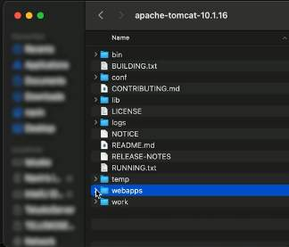
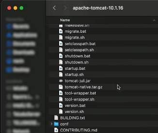
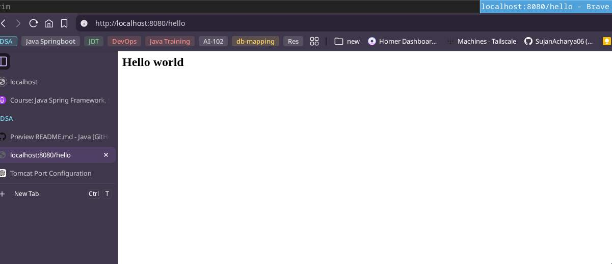
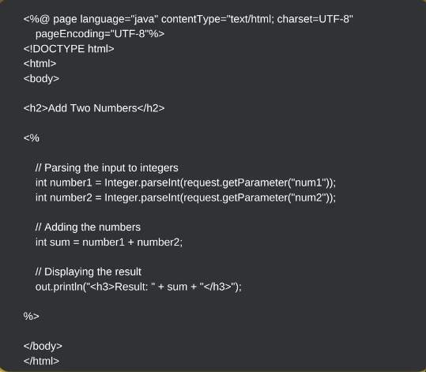
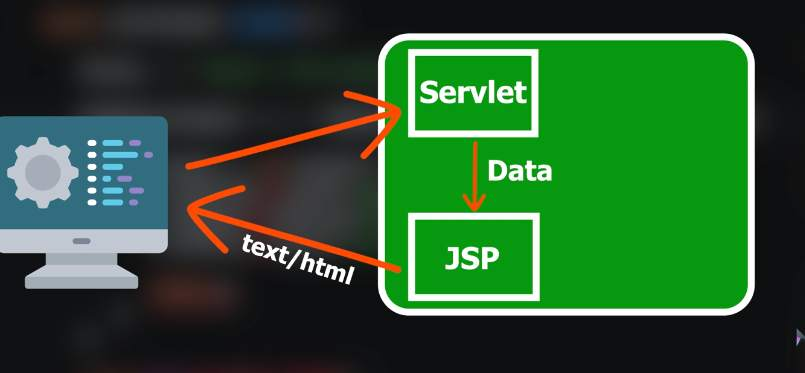
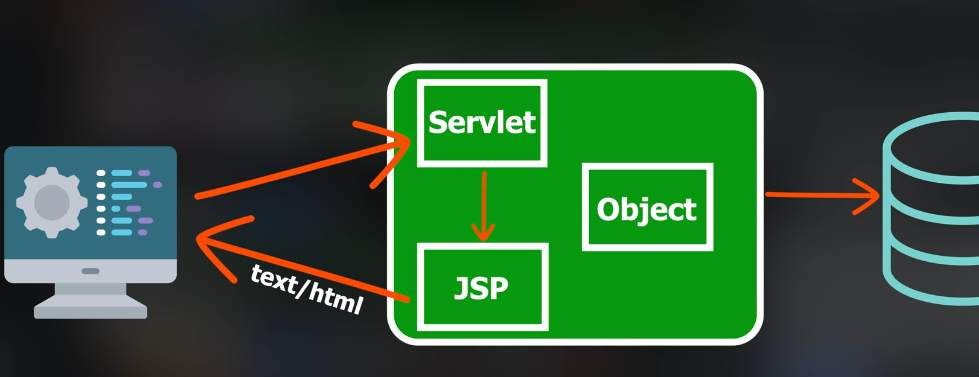
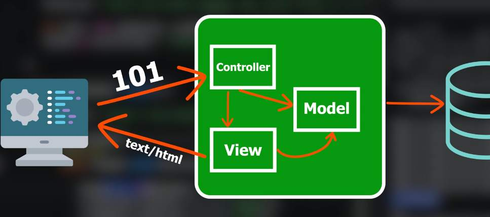

## Spring Boot Web

- Web archives
- embedded tomcat and external tomcat

#### Servlet
- Need to be run in a special `container`
	- called a `web container` or a `servlet container`
	- one of the lightweight option we got is `Apache Tomcat`
		- `Tomcat`
			- is a server in which we can run the servlets
	- We have two options for the webapplication, one is `Servlet` or `Reactive`
		- focous is to work with servlets

#### Creating A Servlet project
- In order to run the `Servlet` we need a container which is the `Tomcat` server
- We can build the server if we want to run this on a server we create a package out of it
	- usually we create a package with extension `.war` -> `web archive`
		- as it runs on `tomcat`
	- we need tomcat server in our machine
	- for console application we use `.jar`

- Tomcat can be configured both `externally` or within the `project itself(use embedded tomcat maven dependency)`

- Initially download latest version of `Apache Tomcat`

1. Tomcat configured externally
	- Make the package(.war or .jar) out of your project
	- place it in `webapps` directory as shown below

- To start the tomcat, inside `bin` folder we have `startup.sh` and `shutdown.sh`


2. To configure embedded `Tomcat` in the project itself
- The advantage of this is that, as we are adding the `embedded tomcat` dependency, when we run the app it will automatically run in this `embedded tomcat server`
> [!NOTE]
> If we would like to build applications with `servlets` it is suggested to go with `external tomcat` as it offers more features 
- Steps
	1. Create a `maven` project
		- `maven-archetype-quickstart`
```bash
mvn archetype:generate \
  -DgroupId=com.example \
  -DartifactId=servletEx \
  -DarchetypeArtifactId=maven-archetype-quickstart \
  -DinteractiveMode=false
```

	2. Add dependency
	```xml
<dependency>
	<groupId>org.apache.tomcat.embed</groupId>
	<artifactId>tomcat-embed-core</artifactId>
	<version>11.0.15</version>
	<scope>compile</scope>
</dependency>
<dependency>
	<groupId>jakarta.servlet</groupId>
	<artifactId>jakarta.servlet-api</artifactId>
	<version>6.1.0</version>
	<scope>provided</scope>
</dependency>
```
	3. Do `mvn compile`
	4. Test the maven project by running -> `mvn exec:java -Dexec.mainClass="com.example.App"`
	
- Building a `Servlet` class
- One of the way to create a `Servlet` is by extending `HttpServlet` class
```java
import jakarta.servlet.http.HttpServlet;

public class HelloServlet extends HttpServlet {

}
```
- For `Request` and `Response` we need special objects which are provided by `HttpServlet`
- `public void service()` is an important method in `Servlet` which get executed whenever we send a request
	- We can use interface `HttpServletRequest` and `HttpServletResponse`
		- however we do not have to implement all the methods as the internal implementation will be done automatically 
	- `service(HttpServletRequest request, HttpServletResponse response)`
		- whatever data comming from `client` will be stored in `request` object and whatever data we want to send back to client will be in `response` object

- Now we need to run the `embedded tomcat`
	- basically we can create the object of `Tomcat` class and use the `start()` method
```java
// App.java
import org.apache.catalina.LifecycleException;
import org.apache.catalina.startup.Tomcat;

public class App {
	public static void main(String[] args) throws LifecycleException {
		System.out.println("Hello World!");

		Tomcat tomcat = new Tomcat();
		tomcat.start();

	}
}
```
- The `start()` method throws a `LifecycleException`
- after starting the application, initially the tomcat server would exit, we can use this on `tomcat` object
	- `tomcat.getServer().await();`
	- get hold of the current server by using `getServer()`
	- to tell the `tomcat server` to keep running and we will send the request later
```output
mvn exec:java -Dexec.mainClass="com.example.App"
[INFO] Scanning for projects...
[INFO] 
[INFO] -----------------------< com.example:servletEx >------------------------
[INFO] Building servletEx 1.0-SNAPSHOT
[INFO]   from pom.xml
[INFO] --------------------------------[ jar ]---------------------------------
[INFO] 
[INFO] --- exec:3.6.3:java (default-cli) @ servletEx ---
Hello World!
Feb 27, 2026 4:03:45 PM org.apache.catalina.core.StandardService startInternal
INFO: Starting service [Tomcat]
...
```

- We can set custom `Port` using
	- `tomcat.setPort(portNumber)`
> [!NOTE]
> We have to call `getConnector()` method else we won't get any response once we hit the url
```java
import org.apache.catalina.startup.Tomcat;

public class App {
	public static void main(String[] args) throws LifecycleException {
		System.out.println("Hello World!");
		Tomcat tomcat = new Tomcat();
		tomcat.setPort(8080);
		tomcat.getConnector();

		tomcat.start();
		tomcat.getServer().await();
	}
}
```

- Now we have to `map` the `uri` to our method
	- so that when we hit that `uri` we can execute our method

#### Servlet Mapping

1. Using external tomcat configuration we can map this
	- using `web.xml` 
		- we specify the `url` and the `servlet`
		- meaning whenever someone requests for this `url` run this `servlet`...
	- If using `annotation` way,
		- we could mention this 
```java
@WebServlet("/hello")
public class HelloServlet extends HttpServlet {
	public void service(HttpServletRequest request, HttpServletResponse response) {

	}
}
```
> [!NOTE]
> Above annotation only when we use external tomcat

2. while using `embedded tomcat`
	- we need to create the object of `Context` -> `import org.apache.catalina.Context;`
		- `Context context = tomcat.addContext(contextPath: "", String dir: null)`
			- by using the `tomcat` object's `addContext()` method we need to pass two parameters
				- contextPath: by default `""`
				- base dir -> if provided will create a new dir structure
				- to not create a directory structure we specify `null`
			- now we can use a static method in `Tomcat` for mapping
				- `Tomcat.addServlet(contectObject context, nameOfTheServlet: HelloServlet, objectOfTheServletClass: new HelloServlet())`
					- the name of the servlet can be anything
			- next we use the `addServletMappingDecoded(uri: "/hello", nameOfTheServlet: HelloServlet)`
	- start and wait for the request after creating the mapping
```java
import org.apache.catalina.Context;
import org.apache.catalina.LifecycleException;
import org.apache.catalina.startup.Tomcat;

public class App {
	public static void main(String[] args) throws LifecycleException {
		System.out.println("Hello World!");
		Tomcat tomcat = new Tomcat();
		tomcat.setPort(8080);
		tomcat.getConnector();

		Context context = tomcat.addContext("", null);
		Tomcat.addServlet(context, "HelloServlet", new HelloServlet());
		context.addServletMappingDecoded("/hello", "HelloServlet");

		tomcat.start();
		tomcat.getServer().await();

	}
}
```

```output
mvn exec:java -Dexec.mainClass="com.example.App"
[INFO] Scanning for projects...
[INFO] 
[INFO] -----------------------< com.example:servletEx >------------------------
[INFO] Building servletEx 1.0-SNAPSHOT
[INFO]   from pom.xml
[INFO] --------------------------------[ jar ]---------------------------------
[INFO] 
[INFO] --- exec:3.6.3:java (default-cli) @ servletEx ---
Hello World!
Feb 27, 2026 4:38:10 PM org.apache.coyote.AbstractProtocol init
INFO: Initializing ProtocolHandler ["http-nio-8080"]
Feb 27, 2026 4:38:10 PM org.apache.catalina.core.StandardService startInternal
INFO: Starting service [Tomcat]
Feb 27, 2026 4:38:10 PM org.apache.catalina.core.StandardEngine startInternal
INFO: Starting Servlet engine: [Apache Tomcat/11.0.15]
Feb 27, 2026 4:38:10 PM org.apache.coyote.AbstractProtocol start
INFO: Starting ProtocolHandler ["http-nio-8080"]
hello from service
```

#### Responding to the client

- The `response` object is anyways sent
	- we can use this to send message back to `client`
	- we use `response.getWriter().println("Message")` method
```java
import java.io.IOException;
import java.util.logging.Logger;

import jakarta.servlet.http.HttpServlet;
import jakarta.servlet.http.HttpServletRequest;
import jakarta.servlet.http.HttpServletResponse;

public class HelloServlet extends HttpServlet {
	private static final Logger logger = Logger.getLogger(HelloServlet.class.getName());

	public void service(HttpServletRequest request, HttpServletResponse response) throws IOException {
		logger.info("Inside servive method");
		response.getWriter().println("Hello world");
	}
}
```
- There is also another way
	- if we see `.getWriter()` returns the object of `PrintWriter`
```java
public void service(HttpServletRequest request, HttpServletResponse response) throws IOException {
	logger.info("Inside servive method");
	PrintWriter out = response.getWriter();
	out.println("Hello world");
}
```
- `out.println("Hello World")`;
	- checks from where we got the out object and display it in web accordingly

- We can also specify the `html` tags in the message for this we have to tell explicitly by using
	- `res.setContentType("text/html")`
```java
public class HelloServlet extends HttpServlet {
	private static final Logger logger = Logger.getLogger(HelloServlet.class.getName());

	public void service(HttpServletRequest request, HttpServletResponse response) throws IOException {
		logger.info("Inside servive method");
		response.setContentType("text/html");
		PrintWriter out = response.getWriter();
		out.println("<h2><b>Hello world</b><h2>");
	}

}
```



- If we want to `Get` the data basically a `GET` request we specify 
	- `doGet()` instead of `service()`
```java
public class HelloServlet extends HttpServlet {
	private static final Logger logger = Logger.getLogger(HelloServlet.class.getName());

	public void doGet(HttpServletRequest request, HttpServletResponse response) throws IOException {
		logger.info("Inside servive method");
		response.setContentType("text/html");
		PrintWriter out = response.getWriter();
		out.println("<h2><u>Hello world</u><h2>");
	}

}
```
- for submitting the data we do `doPost()`...

---

#### Introduction to MVC

- If we try to add html codes along with java, the code becomes bulkier and hard to understand

- MVC (Model View Controller)

- Adding HTML codes inside java
- multiple view technologies
- having an entire HTML code and putting java code in between is possible through 

- `JSP (Jakarta Server Pages), formerly, JavaServer Pages`


- this is also possible through other frameworks like
1. Thymeleaf
2. FreeMarker
3. Groovy Markup
4. Script Views
5. JSP and JSTL

- Servlet is responsible to accept the request from the client
- JSP is responsible to create the web pages



- Data is the object


- Controller -> (Object)Model 
	- Controller <- Model
- Controller -> View
- View -> Model
	- view fetch data from Model, fill up the entire page and then gives it to client

- the `object` in which we have the data is called `Model`
- data will move from the model object to the controller after processing will be accessed by the view and then displayed to the clients



- In terms of sequence it should have been `Controller -> Model -> View (CMV)`

- When we are using `Controller` we will be using `Servlet`
- When we are using `View` we will be using `JSP`
- When we are using `Model` we will be using `Simple java class POJO(Plain old java object)`

- When we write java code inside html basically jsp's
- `tomcat` is a webserver but also is a `servlet container` 
	- which means we can only servlet's inside tomcat
	- so how will it understand `jsp`?
	- behind the scenes the `jsp` page is converted into `servlet`

---

- [MVC with SpringBoot](./MVCwithSpringBoot.md)
