## Spring Boot Unit Testing - JUnit + Mockito + Code coverage

- UnitTesting + Mocking + Code coverage

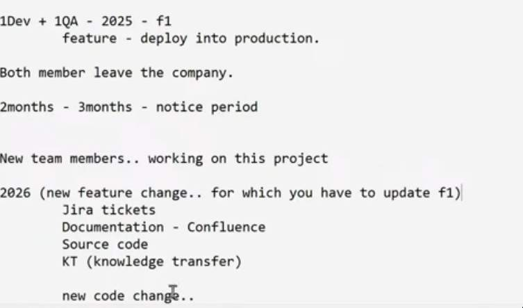

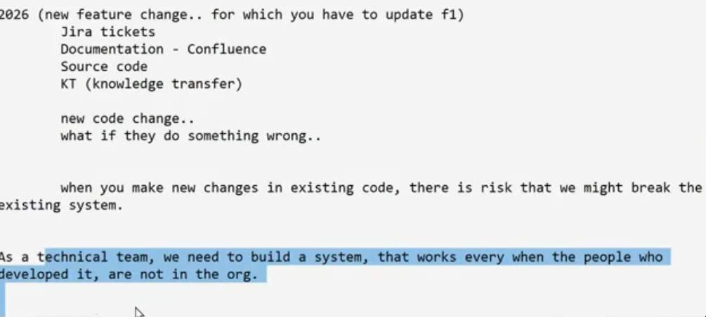

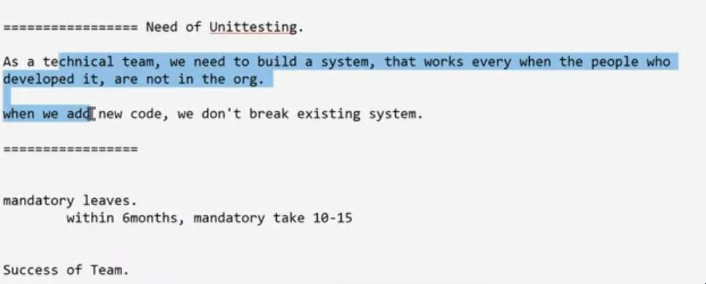

- Unitteting
	- code protects code
	- (Unittesting code) -> protects -> (functional code)

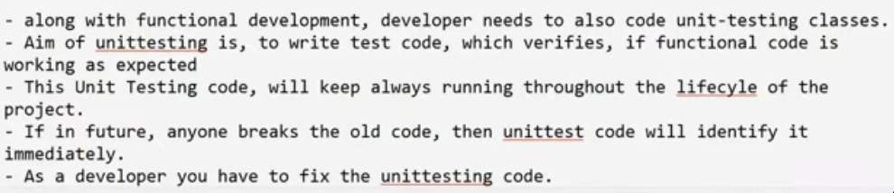

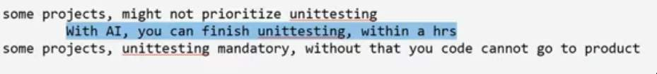

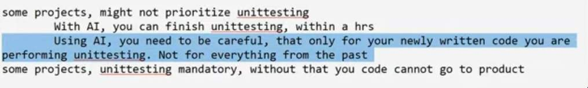

## Key Bullets

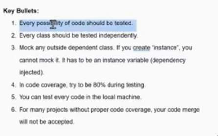

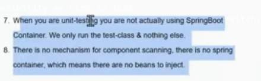

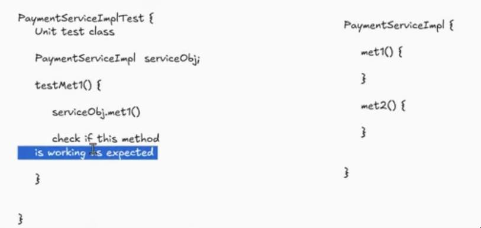

1. For every method each possibility we need to test
	- for every method, each code block should be unit testing(if, do, switch, each statement)

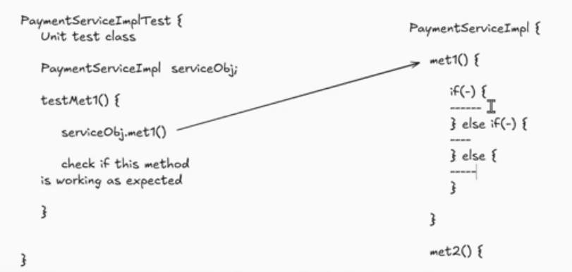

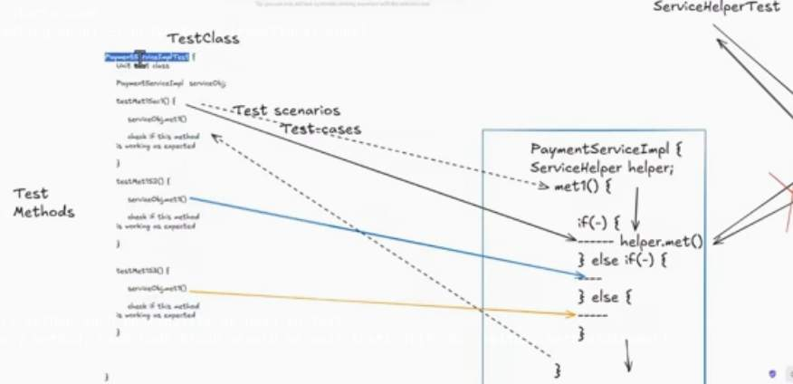

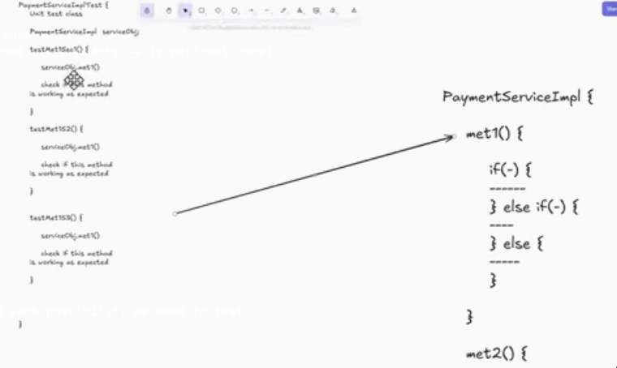

2. Every functional class should be tested independently

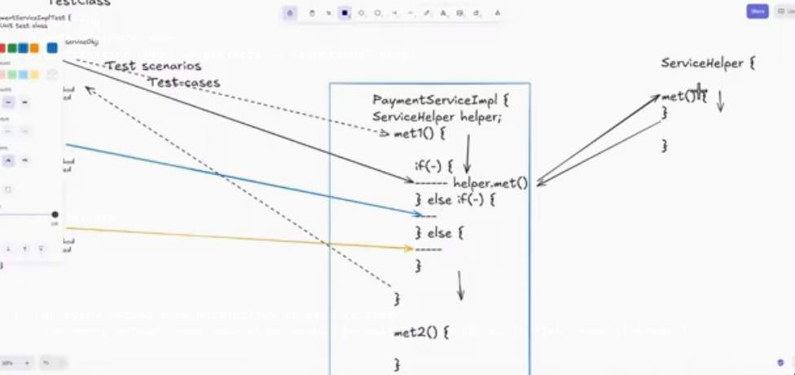

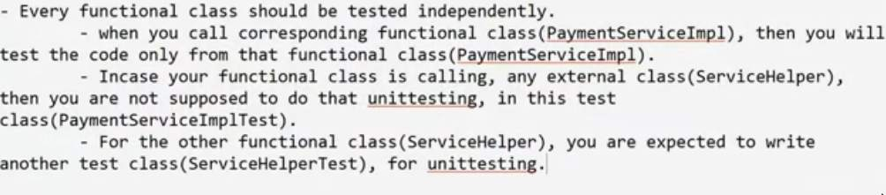

### Mocking

- You are supposed to create `Mock objects` for external dependent classes
- When you call methods on these mock objects, then actual method invocation will not happen

- When doing unit testing, spring container is not activated
- Integration testing -> Spring container is activated

1. functional code -> `src/main/java`
	test code -> `src/test/java`

2. functional class -> `com.thriftyBug.payments.service.impl.PaymentServiceImpl`
for test class -> `com.thriftyBug.payments.service.impl.PaymentServiceImplTest`

- for implementing unit testing there are some libraries / unit testing frameworks
	- popular unit testing framework in the market is JUnit, TestNg

- `spring-boot-starter-test`
	- adds Junit dependencies

- For Mocking also we have some libraries
	- `Mockito`, `PowerMock`

- JUnit + Mockito combination

#### How to execute your Testclass
- create a test method, annotate with `@Test`
- on that class, right click -> run as -> JUnit testing
- for showing results of JUnit, left side panel -> JUnit View is available

- For writing test method, there is a structure - 3 parts
1. `Arrange`
	- arrange data needed to call functional method
2. `Act`
	- you call functional method
3. `Assert`
	- verify if everything happened as expected.

- When running unit-testcases, Spring container is not activated
	- `@Component`, `@Autowired`

- regular spring way of object creation is not applicable during unit testing
- Dependency lookup or injection will not work
- As Spring Container is not activated

- Since spring is not active, how do we get object of functional class?
- Use `new`, but in this case we need to create object of `PaymentServiceImpl`, however before that we need to create object of other dependent classes, `use new operator`
- If you use `new`, when functional class calls helper class, then code will execute helper code also
	- This is in violation of unittesting principle (every class should be tested in isolation)

- `@Extends(MokitoExtension)`
	- class level
- `@Mock`
	- for other dependent classes
- `@InjectMock`
	- to be used where ever we are defining the functional class
