## Spring Book Logging Slf4j + Logback + ELK Stack + S3 + Tracing


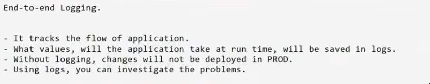

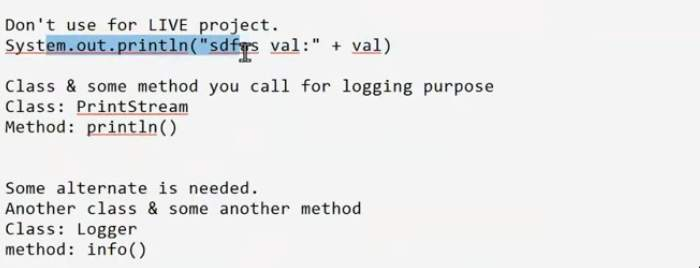


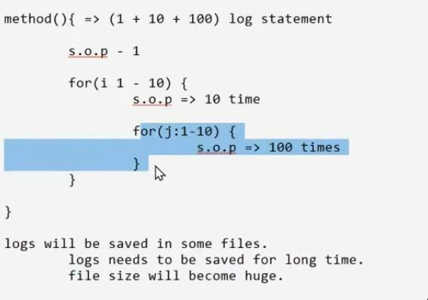

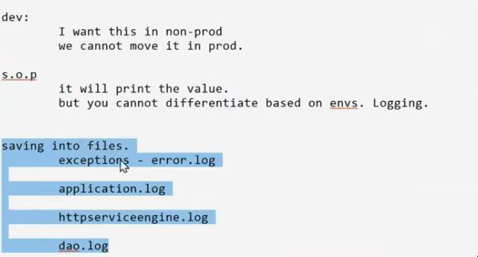

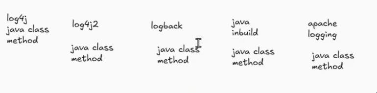


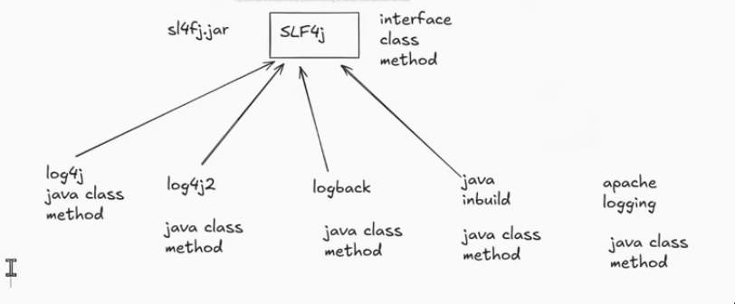

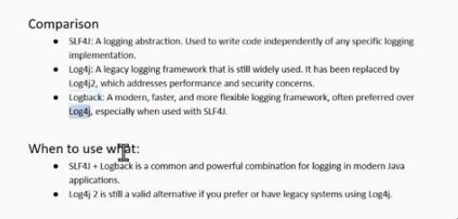

- Slf4j uses `logback` by default

- class?
- To use Logger
	- 1st approach
		- create an object of it
			- `import org.slf4j.Logger`
			- `import org.slf4j.LoggerFactory`
			- `Logger logger = LoggerFactory.getLogger(HelloWorld.class);`
	- 2nd approach
		- use `lombok` -> `@Slf4j` -> log variable

- what method to call?
- There are multiple methods
	1. `trace()` -> more granular than debug
		- by default it will not be printed even in non-prod
		- you need to put additional configured to see trace statement.
	2. `debug()` -> will not be printed in production
		- use debug for testing only till non-prod
	3. `info()` -> info statements will be printed in production 
	4. `warn()` -> something which is warning something is concerning... look into it.. otherwise it can become a problem in future
	5. `error()` -> whenever there is exception and we want to capture the information

- these methods are nothing but `log levels`
- TRACE
- DEBUG
- INFO
- WARN
- ERROR

- There is some `external configuration` which define which log level to print
- DEFAULT `external configuration` is `INFO`

- If `external configuration` is `TRACE`, then `trace()` and above methods will be printed
- external `TRACE`
	- `trace()`
	- `debug()`
	- `info()`
	- `warn()`
	- `error()`

- If `external configuration` is `DEBUG`, then `debug()` and above will be printed
	- for all non-prod system default configuration is `DEBUG` 
- external `DEBUG`
	- `debug()`
	- `info()`
	- `warn()`
	- `error()`

- If `external configuration` is `INFO`, then `info()` and above methods will be printed
	- for production system, default external configuration is `INFO`
- external `INFO`
	- `info()`
	- `warn()`
	- `error()`

	
- If `external configuration` is `WARN`, then `warn()` and above will be printed
- external `WARN`
	- `warn()`
	- `error()`
	
- If `external configuration` is `ERROR`, then `error()` and above will be printed
- external `ERROR`
	- `error()`


- for config, default name is `logback-spring.xml` by default spring looks for logback-spring.xml in the classpath `/src/main/resources`
	- if you just create xml with name logback-spring.xml and put it in class path `src/main/resources`, then spring boot will automatically recognize this file, and pick up changes.
		- you can rename, but you have to additionally configure the new file name in your `.properties` file

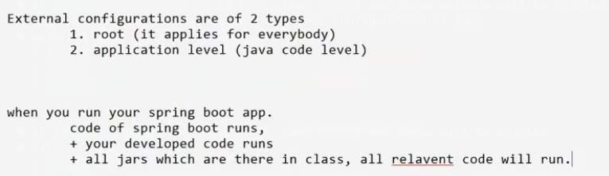

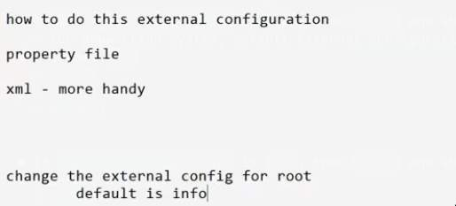

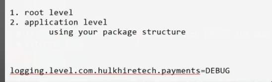

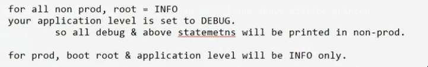

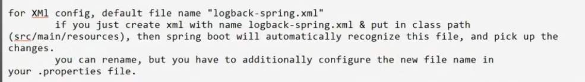


```xml
<?xml version="1.0" encoding="UTF-8"?>
<configuration>

<!-- ===================================================== -->
	<!-- 1️⃣ Define reusable properties -->
	<!-- ===================================================== -->
	<property name="LOG_PATH" value="logs" />
	<property name="APP_NAME" value="springApp" />
	<!--   <property name="LOG_PATTERN" -->
	<!-- value="%d{yyyy-MM-dd HH:mm:ss.SSS} [%thread] %-5level [%X{traceId}] [%logger{36}] - %msg%n" /> -->
	<property name="LOG_PATTERN"
		value="[%-5level] %d{yyyy-MM-dd HH:mm:ss.SSS} [%thread] [${APP_NAME}] %logger - %msg%n" />

	<!-- ===================================================== -->
	<!-- 2️⃣ Console appender -->
	<!-- ===================================================== -->
	<appender name="CONSOLE" class="ch.qos.logback.core.ConsoleAppender">
		<encoder>
			<pattern>${LOG_PATTERN}</pattern>
		</encoder>
	</appender>

	<!-- ===================================================== -->
	<!-- 3️⃣ Rolling file appender -->
	<!-- ===================================================== -->
	<appender name="FILE" class="ch.qos.logback.core.rolling.RollingFileAppender">
		<file>${LOG_PATH}/${APP_NAME}.log</file>

		<!-- Roll files daily -->
		<rollingPolicy class="ch.qos.logback.core.rolling.TimeBasedRollingPolicy">
			<fileNamePattern>${LOG_PATH}/${APP_NAME}.log.%d{yyyy-MM-dd}.gz</fileNamePattern>
			<maxHistory>20</maxHistory> <!-- keep logs for 20 days -->
		</rollingPolicy>

		<encoder>
			<pattern>${LOG_PATTERN}</pattern>
		</encoder>
	</appender>

	<!-- ===================================================== -->
	<!-- 4️⃣ Logger for specific package -->
	<!-- ===================================================== -->
	<logger name="com.thriftybug" level="DEBUG" additivity="false">
		<appender-ref ref="CONSOLE" />
		<appender-ref ref="FILE" />
	</logger>

	<!-- ===================================================== -->
	<!-- 5️⃣ Root logger -->
	<!-- ===================================================== -->
	<root level="INFO">
		<appender-ref ref="CONSOLE" />
		<appender-ref ref="FILE" />
	</root>

</configuration>

```

> [!NOTE]
> For active profiles

```xml
<?xml version="1.0" encoding="UTF-8"?>
<configuration>

	<!-- ===================================================== -->
	<!-- Enable startup diagnostics (optional but useful) -->
	<!-- ===================================================== -->
	<statusListener class="ch.qos.logback.core.status.OnConsoleStatusListener" />

	<!-- ===================================================== -->
	<!-- 1️⃣ Get the active Spring profile -->
	<!-- ===================================================== -->
	<!-- Reads spring.profiles.active from environment or properties -->
	<springProperty scope="context"
		name="spring.profiles.active"
		source="spring.profiles.active"
		defaultValue="local" />

	<!-- ===================================================== -->
	<!-- 2️⃣ Define reusable properties -->
	<!-- ===================================================== -->
	<property name="LOG_PATH" value="logs/${spring.profiles.active}" />
	<property name="APP_NAME" value="springApp" />
	<!-- <property name="LOG_PATTERN" -->
	<!-- 	value="%d{yyyy-MM-dd HH:mm:ss.SSS} [%thread] %-5level [%logger{36}] - %msg%n" /> -->
	<property name="LOG_PATTERN"
		value="[%-5level] HELLO %d{yyyy-MM-dd HH:mm:ss.SSS} [%thread] [${APP_NAME}] %logger - %msg%n" />

	<!-- ===================================================== -->
	<!-- 3️⃣ Console Appender -->
	<!-- ===================================================== -->
	<appender name="CONSOLE" class="ch.qos.logback.core.ConsoleAppender">
		<encoder>
			<pattern>${LOG_PATTERN}</pattern>
		</encoder>
	</appender>

	<!-- ===================================================== -->
	<!-- 4️⃣ Rolling File Appender -->
	<!-- ===================================================== -->
	<appender name="FILE" class="ch.qos.logback.core.rolling.RollingFileAppender">
		<file>${LOG_PATH}/${APP_NAME}.log</file>

		<!-- Roll logs daily and keep for 20 days -->
		<rollingPolicy class="ch.qos.logback.core.rolling.TimeBasedRollingPolicy">
			<fileNamePattern>${LOG_PATH}/${APP_NAME}.log.%d{yyyy-MM-dd}.gz</fileNamePattern>
			<maxHistory>20</maxHistory>
		</rollingPolicy>

		<encoder>
			<pattern>${LOG_PATTERN}</pattern>
		</encoder>
	</appender>

	<!-- ===================================================== -->
	<!-- 5️⃣ (Optional) Separate Error Log File -->
	<!-- ===================================================== -->
	<appender name="ERROR_FILE" class="ch.qos.logback.core.rolling.RollingFileAppender">
		<file>${LOG_PATH}/${APP_NAME}-error.log</file>

		<filter class="ch.qos.logback.classic.filter.LevelFilter">
			<level>ERROR</level>
			<onMatch>ACCEPT</onMatch>
			<onMismatch>DENY</onMismatch>
		</filter>

		<rollingPolicy class="ch.qos.logback.core.rolling.TimeBasedRollingPolicy">
			<fileNamePattern>${LOG_PATH}/${APP_NAME}-error.log.%d{yyyy-MM-dd}.gz</fileNamePattern>
			<maxHistory>20</maxHistory>
		</rollingPolicy>

		<encoder>
			<pattern>${LOG_PATTERN}</pattern>
		</encoder>
	</appender>

	<!-- ===================================================== -->
	<!-- 6️⃣ Package-specific logger (optional example) -->
	<!-- ===================================================== -->
	<logger name="com.thriftybug" level="DEBUG" additivity="false">
		<appender-ref ref="CONSOLE" />
		<appender-ref ref="FILE" />
	</logger>

	<!-- ===================================================== -->
	<!-- 7️⃣ Root logger -->
	<!-- ===================================================== -->
	<root level="INFO">
		<appender-ref ref="CONSOLE" />
		<appender-ref ref="FILE" />
		<appender-ref ref="ERROR_FILE" />
	</root>

</configuration>

```

- `<root> tag is for root level`
- `<logger> tag is for application level configuration`

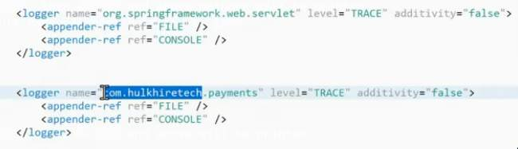

- we can specify the package name also the package name have unique group id

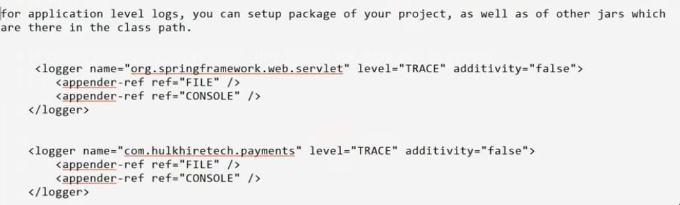

- appender, where your log statements should be printed

- using `<appender>` we can define our console or file logging setting. 
- and use `<appender-ref ref="FILE"/>` or `<appender-ref ref="CONSOLE"/>` 
	- `<appender-ref ref="FILE"/>` 
		- in the xml it will look for `<appender>` tag with name = "FILE" <appender name="FILE">
	- whatever values is defined in appender will take effect


### Conversion words

- `%level`
	- `%-5level` -> reserve 5 characters so that there is correct alignment
	- `%d{yyyy-MM-dd HH:mm:ss.SSS}` -> shows the date and time, by specifying the format 
	- `%thread` -> specifies which thread is being used
	- `${log-path}` or `${springAppName}` -> we can use this by specifying the `property` or `springProperty` tag
		- `<springProperty scope="context" name="log-path" source="logging-path"/>` 
		- `<springProperty scope="context" name="springAppName" source="spring.application.name"/>` 
	- `%logger` -> for the log we write in our code
		- `%logger{36}` 
			- logger name shortened to 36 characters
		 	- reduces the package name
			- `c.t.p.PaymentProcessingServiceApplication`
	- `%msg` -> what message was given as argument to the logger object
	- `%n` -> for new line

	- Adding `%M` gives the method where the log was used
		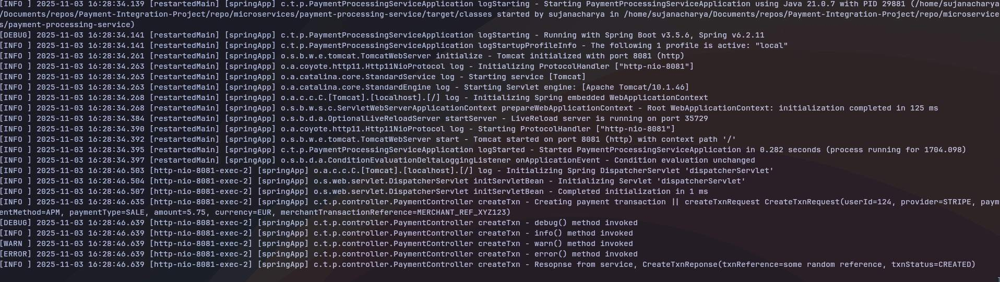
	- `<property name="LOG_PATTERN" value="[%-5level] %d{yyyy-MM-dd HH:mm:ss.SSS} [%thread] [${APP_NAME}] %logger{36} %M - %msg%n" />`
	- `<property name="LOG_PATTERN" value="[%-5level] %d{yyyy-MM-dd HH:mm:ss.SSS} [%thread] [${APP_NAME}] %logger{36} %M\(\) - %msg%n" />`
 
 	- `@...@` value will come from `pom.xml`


- `<springProperty>` -> you want to read some values from `other` property file we use `springProperty` tag
```xml
<springProperty scope="context" name="log-path" source="logging-path"/> 
<springProperty scope="context" name="springAppName" source="spring.application.name"/> 
```

### Rolling file concept

#### Timebased rolling
- for every 30 min write to a new file and reset the current one
- `<fileNamePattern>@logging.path@/${springAppName}.log.%d{yyyy-MM-dd_HH-mm-ss}</fileNamePattern>`
- `<maxHistory>20</maxHistory>`
	- every second file got rolled and a maximum of 20 seconds file will be in the harddisk

- if you change the pattern of file name, accordingly the rolling time is decided

- if we want daily rolling we can keep this settings
- `<fileNamePattern>@logging.path@/${springAppName}.log.%d{yyyy-MM-dd}</fileNamePattern>`


#### Size based rolling
- when size increases certain amount move and reset the file

- `<fileNamePattern>@logging.path@/${springAppName}.log.%d{yyyy-MM-dd_HH-mm-ss}</fileNamePattern>`
- `<maxHistory>20</maxHistory>` maximum of 20 hours of file should be available
	- `%d{yyyy-MM-dd_HH-mm-ss}`
		- maintain only past 20 (x) x=seconds of files.
		- and not 20 number of files
	- `%d{yyyy-MM-dd_HH}`
		- maintain only past 20 hours of files

- in prod we setup at daily level
1. Logs should be maintained for long time. 10 yr
	- how to keep logs for long term?
2. On EC2 machine, logs cannot be kept for long(100 percent HD)
	- where do you keep log for long?
3. we are using microservice, we need to investigate in multiple log file when trying to find the solutions. 
	- process -> stripe
	- process.log
	- stripe-provide.log
		- across microservice is there a easy way to have logs..


---

### ELK (Elastic Search, Logstash, Kibana)

- Elastic stack


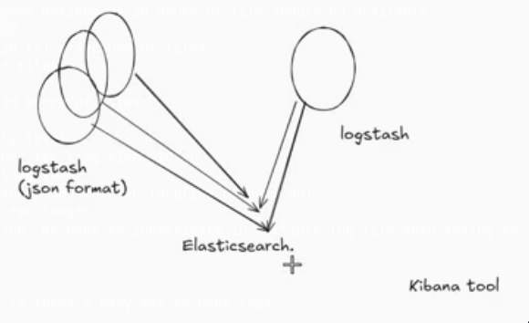

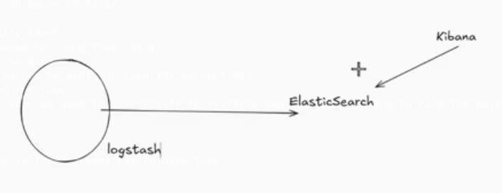

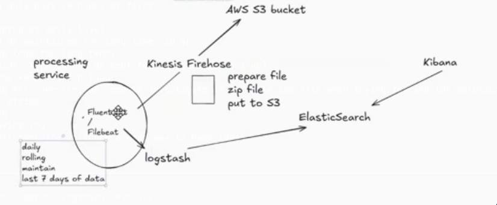

#### traceId and spanId

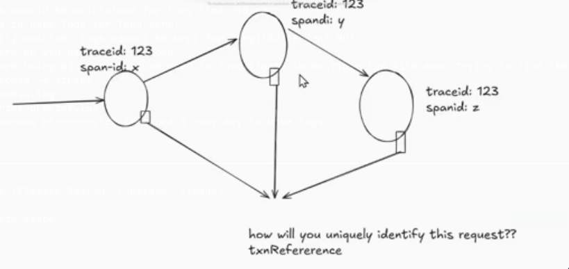

- Distributed logging
	- Spring boot 2.x
		- Sleuth
	- Spring boot 3.x
		- Micrometer and brave libraries
- [%X{traceID:-}] [%X{spanId:-}]
- `<property name="LOG_PATTERN" value="[%-5level] [%X{traceID:-}] [%X{spanId:-}] %d{yyyy-MM-dd HH:mm:ss.SSS} [%thread] [${APP_NAME}] %logger{36} %M - %msg%n" />`

- need to add actuator, micrometer and brave dependencies in pom.xml file

---

### Useful links

- [https://sematext.com/blog/slf4j-tutorial](https://sematext.com/blog/slf4j-tutorial/)
- [slf4j.org](https://slf4j.org/manual.html)
