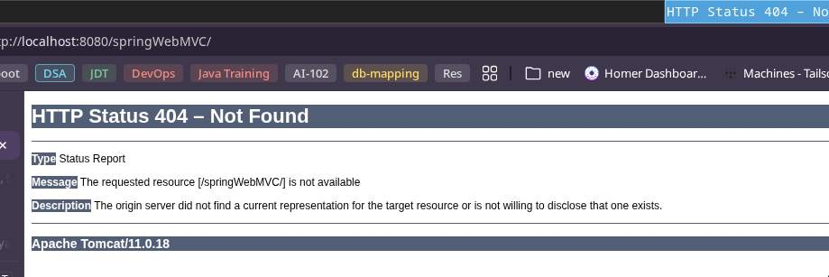
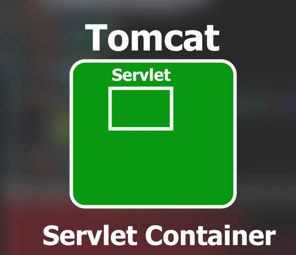
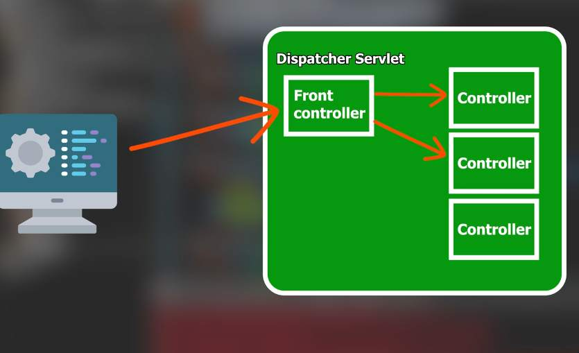
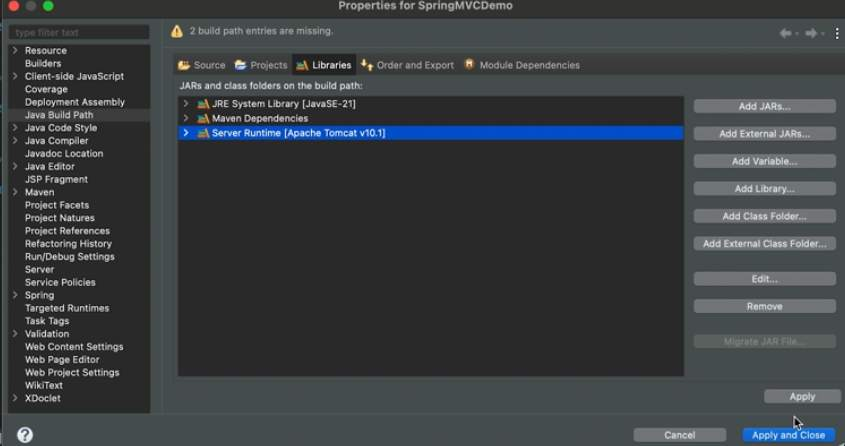
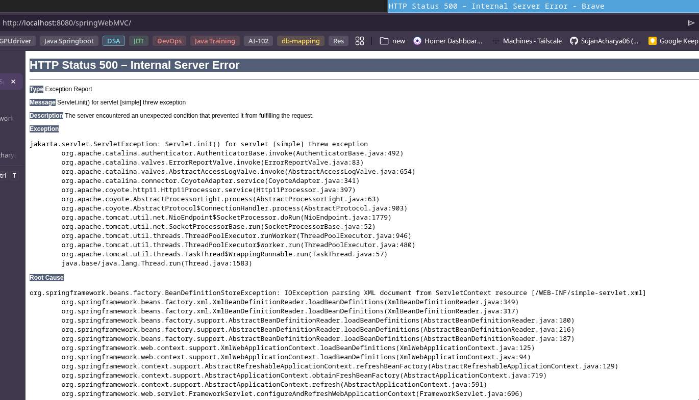

## Web MVC with Spring

- When using Spring we have to configure everything course
- Steps to replicate Web MVC using spring

1. Create a `maven-archetype-webapp` project
```bash
mvn archetype:generate \
  -DgroupId=com.example \
  -DartifactId=demowebapp \
  -DarchetypeArtifactId=maven-archetype-webapp \
  -DinteractiveMode=false
```

- This gives a default structure
- create the package structure separately

1.1 Add `spring-mvc` maven dependency from maven repository
```xml
<dependency>
	<groupId>org.springframework</groupId>
	<artifactId>spring-webmvc</artifactId>
	<version>7.0.3</version>
	<scope>compile</scope>
</dependency>
```

---
1.2 Running the Web Application with External Tomcat

This project is a Maven `war`-packaged web application and is intended to run on an external **Apache Tomcat** server.

## Prerequisites

* JDK 21 (or compatible)
* Maven installed
* Apache Tomcat 11.0.18 downloaded and extracted

Example Tomcat location:

```bash
~/Applications/Server/apache-tomcat/apache-tomcat-11.0.18
```

Set this path as:

```bash
$CATALINA_HOME
```

---

## 1. Build the WAR File

From the project root:

```bash
mvn clean package
```

After successful build, the WAR file will be generated inside:

```
target/<artifactId>.war
```

---

## 2. Deploy the WAR to Tomcat

Copy the generated WAR file into Tomcat’s `webapps` directory:

```bash
cp target/*.war $CATALINA_HOME/webapps/
```

Tomcat will automatically extract and deploy the application.

---

## 3. Start Tomcat

Navigate to Tomcat’s `bin` directory:

```bash
cd $CATALINA_HOME/bin
```

Start Tomcat:

```bash
./startup.sh
```

For development (recommended), run in foreground to see logs:

```bash
./catalina.sh run
```

---

## 4. Access the Application

Open in browser:

```
http://localhost:8080/<war-name>
```

Example:

```
http://localhost:8080/WebMVCwithSpring
```

---

## Automated Script

You can automate build and deployment using a script.

Create a file named `run.sh` in the project root:

```bash
#!/bin/bash

TOMCAT_HOME=~/Applications/Server/apache-tomcat/apache-tomcat-11.0.18

echo "Building project..."
mvn clean package || exit 1

echo "Removing old deployment..."
rm -rf $TOMCAT_HOME/webapps/$(basename $(ls target/*.war) .war)*

echo "Copying WAR to Tomcat..."
cp target/*.war $TOMCAT_HOME/webapps/

echo "Starting Tomcat..."
$TOMCAT_HOME/bin/catalina.sh run
```

Make it executable:

```bash
chmod +x run.sh
```

Run it using:

```bash
./run.sh
```

---

## Notes

* Every `.war` file inside `webapps/` is deployed automatically.
* Multiple applications can run simultaneously.
* If using Tomcat 11, ensure your project uses `jakarta.servlet.*` instead of `javax.servlet.*`.
---

- Now, when we check
	- `http://localhost:8080/`
	- we get this screen



- As this is a maven project and not a `spring-boot` project, maven has no idea of the mappings
- Maven project is running on `tomcat`, `tomcat` being a `serblet container` it is responsible to run the `servlets`
- there has to be a mapping for `request` and `servlet`



- for `different requests` we have `different controllers`
- for navigating these `controllers` we have a `front controller` 
- When a client sends a request the request will go first to `Front controller`
- This `Front controllers` is called as `DispatcherServlet`



- `DispatcherServlet` is the first controller the request goes through

- Spring already have a `DispatcherServlet` we just have to configure it
- The only file which we can use for mapping is `web.xml`

2. Configuring `web.xml`
```xml
<!DOCTYPE web-app PUBLIC "-//Sun Microsystems, Inc.//DTD Web Application 2.3//EN" "http://java.sun.com/dtd/web-app_2_3.dtd">

<web-app>
	<display-name>Archetype Created Web Application</display-name>
	<servlet>
		<servlet-name>simple</servlet-name>
		<servlet-class>org.springframework.web.servlet.DispatcherServlet</servlet-class>
	</servlet>

	<servlet-mapping>
		<servlet-name>simple</servlet-name>
		<url-pattern>/</url-pattern>
	</servlet-mapping>
</web-app>
```
- we use `<servlet-mapping>` tag and inside it `<url-pattern>` to specify the url
- in `<servlet>` tag we can mention the fully qualified name of the `DispatcherServlet` class i.e `org.springframework.web.servlet.DispatcherServlet`
	- this is telling `tomcat` that every time you receive a request send the request to `DispatcherServlet`, `DispatcherServlet` will take care of where to send it 
- now to connect both of them we use `servlet-name` tag

> [!NOTE]
> When using `Eclipse` IDE We need to add `tomcat` library, we can do this by right clicking on project name and going to `BuildPath` 
- In `Libraries` -> `Add libraries` add the `Server Runtime` 


- Once after we run the tomcat server and hit the endpoint we get following error


